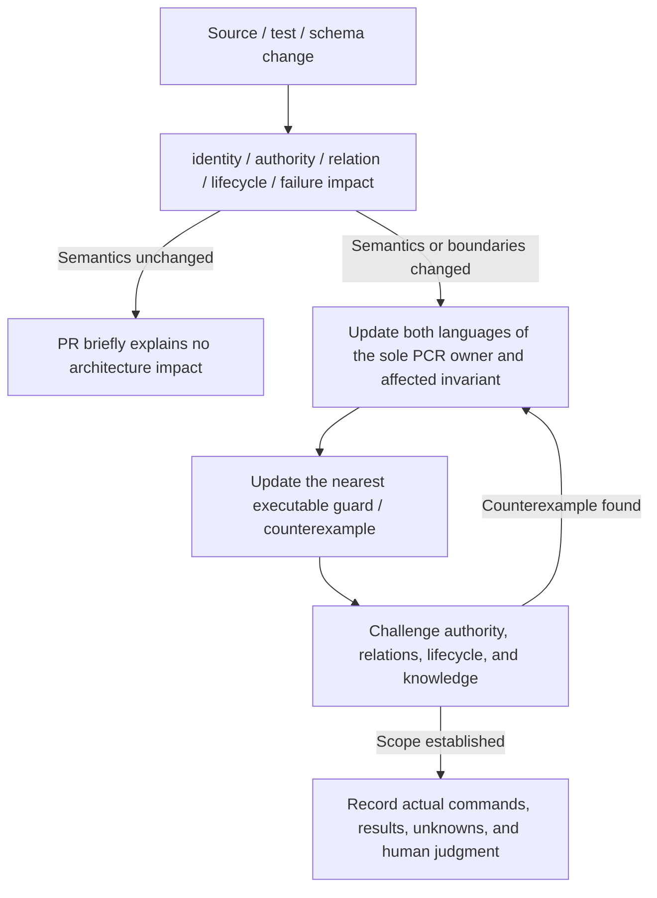

# Limina Architecture Review and Maintenance

[English](./limina-architecture-workflow.md) | [简体中文](./zh/limina-architecture-workflow.md)

This page defines the repo-native workflow established by this work. It contains maintenance guidance and repository operating conventions, not historical design intent inferred from source. Start at [limina.md](./limina.md); do not create separate docs/architecture or ADR copies.

## Explain invariant impact in the PR

First preserve the index/worktree baseline from `git status --short` and read the nearest AGENTS and owning PCR. Reconstruct the affected chain from the current changed code before comparing it with earlier prose. Explain before/after behavior through a concrete trigger, then use this table to locate the impact.

| Change entry point                                                              | Consumers that must be traced                                             | Invariants / prose owner                                                   |
| ------------------------------------------------------------------------------- | ------------------------------------------------------------------------- | -------------------------------------------------------------------------- |
| Workspace discovery, regions, exclude, package identity, output scopes          | Ownership, graph/source/proof, mutation authority                         | I01/I08/I10; system model / lifecycle                                      |
| Checker selection, semantic authority, pending/final owner, solution closure    | Facts, coloring, checker target, proof                                    | I02/I04/I07/I08; system model / semantics                                  |
| Roots, tsconfig options/extends/types, module resolution, source maps           | Occurrence identity, TypeEvidence, referenceRequirement, graph projection | I03/I04/I05/I06; semantics                                                 |
| Reference inference, implicitRefs, output attribution, edge type                | Coloring, generated config, SCC, checker plan, export view                | I06/I07; system model                                                      |
| Cache key, provider/context ownership, async preparation, executor command step | Invalidation, dispose, receipt, snapshot freshness                        | I09/I12; lifecycle                                                         |
| Namespace, materializer, managed output, migration                              | Physical authority, revision, partial failure, recovery                   | I10/I11; lifecycle                                                         |
| Findings, issue identity, query, snapshot/schema                                | Deduplication, terminal/machine output, latest/standalone freshness       | I12; lifecycle                                                             |
| Public commands/config/package exports/checker tuple                            | Schema, docs, tool availability, release/package contract                 | Entry record + relevant owner; determine the invariant from the observable |

Review must answer concrete questions rather than merely checking “no architectural impact”:

1. Have the creators of inputs, identity, or authority changed? Which fields are final and which are still pending? Is a runtime path being promoted to checker evidence?
2. Do producer and consumer still use the same relation meaning? Are source ownership, compiler membership, declaration references, scheduling, and artifact attribution being conflated?
3. Beyond the success path, how are missing/unsupported/conflict/partial-write/cancelled or not-run states expressed? Is there silent fallback or reuse of an older success?
4. Does the change extend cache lifetime, share contexts, or add async publication? Who invalidates content/config/toolchain/membership changes? Can an old result still publish into a new generation?
5. What minimal counterexample could make the new implementation fail? Does it protect a semantic observable or merely freeze function names, directories, or current implementation steps?
6. Which sole PCR owner and its English/Chinese pair, guard, and public documentation need updates? When there is no architecture impact, briefly explain why identity/authority/relation/lifetime/failure/public observables all remain unchanged.

## Where to place guards

Prefer types or assertions at the nearest entry where an illegal state forms. Use focused semantic tests for cross-module properties and architecture tests/lint for static dependency rules. Do not replace a missing entry contract with ever more downstream snapshots, or write tautological tests for file moves.

Add a guard during this kind of knowledge maintenance only when the current invariant and long-term semantic boundary are clear, a real gap exists, the diff is small, and it requires neither production behavior changes nor freezing incidental structure. If a production defect needs a behavioral fix, first provide a reviewable finding and counterexample rather than silently fixing behavior during prose maintenance. The [evidence matrix](./limina-invariants.md#evidence-matrix-and-guard-decisions) records the choices made here.

A stable guard should answer “which incorrect state would be accepted if this check were removed?” Merely checking that a class/method exists, a particular helper is used, or documentation contains a string usually cannot answer that question.

## Knowledge update loop



Knowledge update triggers include adding/removing authority, changing phase inputs/outputs, reference/edge meaning, cache keys/lifetime, failure fallback, materialization protocols, coverage boundaries, and public compatibility contracts. A pure file move updates evidence links; formatting and behavior-preserving helper extraction usually do not add invariants. Moving a test must not silently break its evidence links.

Keep each current truth in one full owner. Other pages retain short conclusions and links; do not append chains of “later changed to...” superseding text. Remove or narrow stale claims directly and explain corrections in the commit diff or audit. Link mechanical schema/version/tuple tables to source constants where possible; a second PCR enumeration must not become compatibility authority.

The owner's public-facing English file is `.agents/docs/<name>.md`; its Chinese counterpart is `.agents/docs/zh/<name>.md`, with the same filename and both tracked by Git. Every PCR update trigger requires synchronous maintenance of the complete pair in the same change, including prose-only corrections and additions/renames/moves/deletions. Follow the [repository bilingual rule](../../AGENTS.md#bilingual-pcr-maintenance) and the [map's maintenance procedure](./README.md#bilingual-publishing-and-maintenance). These are two language editions of one owner, with identical meaning and evidence, not independent records of truth.

Update `Confirmed / Derived / Candidate / NOT VERIFIED` with the evidence, keeping source-established and runtime-verified claims distinct. Preserve conflicts between source and vouched direction without inventing rationale or vouches. Use a decision ledger only after a human explicitly establishes it. Do not cite private memory as product direction in public records.

Before completing maintenance, check whether the map quickly locates the owning page, Mermaid matches actual dependencies/timing, each core invariant has a statement, scope, problem/cause/mechanism/example/protected property, source/tests, strength/confidence, and open questions have not become implicit commitments. Compare both editions section by section for complete semantic equivalence, matching filenames, examples, evidence, dates, and status; check links and heading anchors in both locations.

## Reusable PR review record

```text
Trigger and resulting behavior:
Affected invariants: Ixx / none, with reason
Authority / identity / relation / lifecycle changes:
Owning PCR English/Chinese pair and source guard:
Counterexample: input + expected observable + why independent
Validation: exact command, environment, result, omitted conditions
Findings: P0-P3 + BLOCKING / NON-BLOCKING / NO DEFECT
Human decision required: concrete scope, alternatives, remaining question
```

P0/P1 denotes severe correctness/authority/freshness failures; P2 denotes a bounded defect or credible maintenance risk; P3 denotes limited drift/clarity problems. BLOCKING must identify the merge or claim being blocked; an undecided direction, missing network/toolchain access, or one sandbox failure is not automatically a production defect. NO DEFECT should also state its boundary, such as “TypeScript semantic authority + vue-tsc final owner is an allowed combination.”

## Validation selection and known execution traps

Discover targets with `pnpm nx show project limina`. For governed production source/config changes, follow root AGENTS and run `pnpm exec limina check`; on failure read `pnpm exec limina check --issues --format json`. For tests/guards, run unit/typecheck/lint as required by package AGENTS. The current lint target uses `eslint --fix`; in a dirty worktree, use non-fixing ESLint and explain the substitution so unrelated content is not rewritten. PCR-only changes require formatting, English/Chinese content parity, links, source anchors, relevant semantic evidence, and Git boundary checks, not an automatic full build/package/release run.

Empirical conclusions follow the root verification protocol: create a faithful minimal repro under `~/Project/dev-server-repo/repros/<topic>/`; run at least three independent rounds that change consequential dimensions and seek to disprove the proposition; record intent, independence, commands/conditions, and observations. After revising a proposition, repeat the relevant challenges. If a key toolchain/platform condition cannot be preserved, label it NOT VERIFIED rather than presenting source reading as an experiment.

The following supporting traps retain observed causes and source/test anchors without becoming new core invariants:

| Trap                                                                          | Action and reason                                                                                                                                                                                                                                                                                                                      | Evidence owner                                                                                                                                                                                                                            |
| ----------------------------------------------------------------------------- | -------------------------------------------------------------------------------------------------------------------------------------------------------------------------------------------------------------------------------------------------------------------------------------------------------------------------------------- | ----------------------------------------------------------------------------------------------------------------------------------------------------------------------------------------------------------------------------------------- |
| CLI subprocess returns empty stdout                                           | Preserve stderr/exit first; tsx `listen EPERM` occurs during IPC startup, before the business assertion                                                                                                                                                                                                                                | `bin/limina.js`; [this validation](./limina-architecture-audit.md#validation)                                                                                                                                                             |
| Process tests contaminate the same `.limina` namespace                        | Run namespace-mutating commands sequentially; independent queries can be read-only after inventory exists; prefer in-process matrices with representative CLI wiring cases                                                                                                                                                             | [CLI tests](../../packages/limina/src/__tests__/cli.spec.ts), [attempt tests](../../packages/limina/src/__tests__/check-attempt.spec.ts)                                                                                                  |
| Windows unit tests exceed a single-case deadline or lose timer overlap        | Split independent CLI and syntax matrices into bounded cases without dropping inputs; use a runner-start barrier for concurrency assertions instead of assuming 10–30 ms timers overlap under load                                                                                                                                     | [CLI tests](../../packages/limina/src/__tests__/cli.spec.ts), [syntax differential](../../packages/limina/src/__tests__/source-syntax-differential.spec.ts), [checker build tests](../../packages/limina/src/__tests__/typecheck.spec.ts) |
| Generated config projection tests start repeated compiler processes           | Check the source with a TypeScript Program and build both generated configs with one SolutionBuilder per variant; assert both declaration and output artifacts. A three-process case can exceed the Windows 30-second deadline under full-suite load.                                                                                  | [Generated graph tests](../../packages/limina/src/__tests__/generated-graph.spec.ts)                                                                                                                                                      |
| Windows paths / inline ESM                                                    | Compare fixture.path/portable helper values; filesystem inputs may remain native; child imports use file URLs                                                                                                                                                                                                                          | [Package AGENTS](../../packages/limina/AGENTS.md), [path helpers](../../packages/limina/src/__tests__/helpers/path.ts)                                                                                                                    |
| Polling races obscure materialization contention                              | Release paused children through an already-open IPC channel; include stdout/stderr on failure                                                                                                                                                                                                                                          | [Recovery tests](../../packages/limina/src/__tests__/materialization-recovery.spec.ts)                                                                                                                                                    |
| Region index loses owner attribution after a cut                              | Precomputation must preserve the nearest activated package's attribution identity: a deeper boundary for the same owner still replaces the earlier boundary, while descendant activation selects a new owner; propagating only a null owner after a cut changes diagnostics                                                            | Nearest owner cut, canonical relocation, and re-entry counterexamples in [workspace directory index tests](../../packages/limina/src/__tests__/workspace-directory-index.spec.ts)                                                         |
| Repository config integration test repeats whole-repository semantic analysis | Load the actual root config, then point only the graph provider's rootDir at a minimal temporary pnpm workspace; preserve actual checker selection, entry paths, and nonempty-reference assertions. CI `pnpm check` still covers the full repository graph, keeping this command-contract test's cost independent of repository growth | [Root config test](../../packages/limina/integration/tests/root-config.spec.ts), [CI](../../.github/workflows/ci.yml)                                                                                                                     |
| Scoped pnpm fixture is unreachable on Windows                                 | Keep the namespace directory physical and junction individual packages; avoid making the namespace itself a nested reparse point                                                                                                                                                                                                       | [Integration helpers](../../packages/limina/integration/helpers/)                                                                                                                                                                         |
| Detector fixture HOME/XDG isolation hides pnpm                                | Resolve the host Corepack cache before isolation, preserve COREPACK_HOME, disable latest discovery, and reject fixture overrides of reserved values                                                                                                                                                                                    | [Detector environment](../../packages/limina/integration/helpers/detector-environment.ts), [harness tests](../../packages/limina/integration/tests/detector-harness.spec.ts)                                                              |
| Stream-fault fixture loses peer output or misses its occurrence               | Count complete newline-terminated stdout/stderr pairs from the controlled helper and defer injection until both are forwarded. Stream errors terminate the child; pipe chunks can split or combine writes, and the streams arrive independently. Preserve output and fault-consumption assertions.                                     | [Observer](../../packages/limina/integration/helpers/fault-process-output.ts), [tests](../../packages/limina/integration/tests/fault-injection-harness.spec.ts)                                                                           |

The [pipeline discovery-rendering test](../../packages/limina/src/__tests__/pipeline.spec.ts) waits for an explicit generated-graph provider start signal, then asserts the complete task tree while that provider's result remains pending. Starting discovery includes earlier attempt-publication I/O and workspace validation; `vi.waitFor`'s default one-second deadline is not a startup contract. Race the signal against pipeline completion so an earlier failure cannot leave the test waiting for a provider that will never run. Release the held provider and join the pipeline in `finally` before removing its fixture, including when a rendering assertion fails. This changes test synchronization, not production scheduling or timeout policy.

Generated-command tests must distinguish launch identity from path text: an installed Limina entry can live under `node_modules/.pnpm`, and workspace or Node paths can also contain `pnpm`. Rejecting that substring misclassifies a direct Node invocation. Compare the command tokens and shell probe's canonical Node executable and installed CLI entry instead, while retaining exact argv/cwd and real-shell replay checks. [Command tests](../../packages/limina/src/__tests__/standalone-invocation-command.spec.ts) cover pnpm-bearing paths; [packed-consumer smoke](../../packages/limina/smoke/generated-command.spec.ts) covers installed entry identity. Local POSIX replay does not establish Windows PowerShell success; that requires the [Windows CI jobs](../../.github/workflows/ci.yml).

Generated invocation queries use `shell-quote/quote.js` for POSIX argument quoting and the existing Base64 JSON Node transport for Windows PowerShell 5.1 and PowerShell 7. Windows emits only the labeled PowerShell command: POSIX quoting must not be reused for CMD, and there is no CMD variant. The quote-only entry avoids bundling the unused parser and removes shescape's shell discovery dependency without raising Limina's Node floor. Do not replace shell quoting with JSON stringification or ad hoc escaping. The POSIX adapter splits each argument at `!`, quotes every fragment and separator through the library, and concatenates them into the same shell word: shell-quote 1.10.0 otherwise emits a backslash before `!` inside double quotes that POSIX shells preserve when an argument also contains a single quote. The sensitive-argument regression tests cover this combined input and leading, trailing, and repeated exclamation marks. The PowerShell runner appends trailing arguments to the encoded argv so options such as `--format json` and query filters reach Limina. The [single-package replay test](../../packages/limina/src/__tests__/single-package-cli.spec.ts) appends JSON output selection after removing the config and preserves the I12 query identity and non-mutation checks; [packed-consumer shell replay](../../packages/limina/smoke/generated-command.spec.ts) exercises the installed entry under each supported shell. Native Windows execution remains the platform verification boundary.

The PowerShell evidence probe in the generated-command smoke test has its own subprocess deadline. A Windows / Node 24.11 CI failure exhausted the old 30-second limit with empty stdout/stderr before shell replay; the log does not distinguish shell startup from command discovery. Keep the probe non-interactive, disable module autoloading only inside the command-discovery script block, and restrict pnpm lookup to PATH applications/scripts with terminating errors. Its bounded 180-second deadline matches the existing shell replay budget; do not swallow probe failures, skip either PowerShell version, or raise global timeouts. Preserve pnpm-source and version assertions plus exact argv/cwd, executable, installed-entry and invocation checks. Controlled subprocess timing tests can establish deadline and error propagation behavior, but cannot establish native Windows recovery or identify the runner's delay; Windows CI remains the required platform evidence.

PowerShell command discovery can return multiple pnpm sources, including both `.ps1` and `.CMD` launchers. The evidence probe serializes a named `pnpmSources` array and `version` field as JSON; positional stdout lines cannot distinguish a second source from the version. Restrict module autoloading inside the discovery script block so the subsequent `ConvertTo-Json` can load its built-in utility module. Reject empty or malformed sources and preserve the separate 5.1/7 version assertions. [Parser regressions](../../packages/limina/smoke/generated-command.spec.ts) cover one and multiple sources plus malformed evidence; native Windows shell replay remains required.

The [CLI regression tests](../../packages/limina/src/__tests__/cli.spec.ts) capture CAC 7 help through `console.info`; spying on `console.log` returns an empty capture even when help is printed. Standalone failures must emit exactly one labeled query for the current platform, with no CMD variant. Decode the PowerShell transport or parse the POSIX command and compare the Node executable, CLI entry, and complete argv; check the PowerShell working directory separately. Keep snapshot preservation and cross-directory issue queries in the same regression. A mode containing `pnpm` guards against treating ordinary argument text as a launcher identity.

Dependency license/security policy belongs to [dependency admission](./dependency-admission.md), workspace pins, and actual CI configuration; framework semantics does not own exception authorization. Changes to accepted toolchain tuples require tests of the corresponding conditions; pnpm store/hoist paths are not compatibility predicates.
