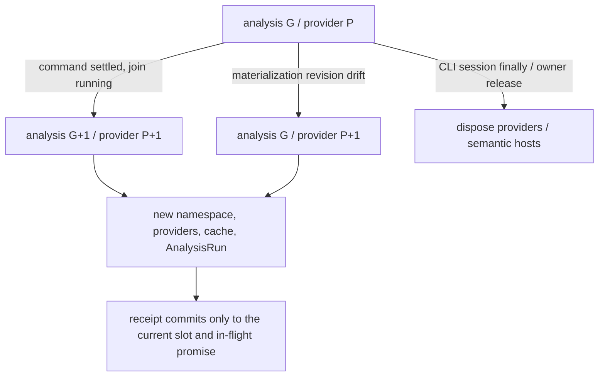

# Limina lifecycle and publication

[English](./limina-lifecycle.md) | [简体中文](./zh/limina-lifecycle.md)

This page owns the full explanation of generations, caches, disposal, artifact mutation, migration, and issue freshness. They protect analysis validity, write authority, publication integrity, and result freshness respectively; they cannot be collapsed into “all state belongs to one generation.”

## Runs, provider generations, and asynchronous publication

The [preflight manager](../../packages/limina/src/preflight/manager.ts) has `#generation` and `#providerGeneration`. A command boundary normally advances both. When base revision drift triggers a materialization replan, only providers, namespace, and caches refresh; the analysis task generation stays unchanged. The snapshot token includes the root and both generations. The numbers themselves are not physical file versions.

[executor](../../packages/limina/src/execution/executor.ts) is the current production entry point for creating the generation controller. After command settlement marks an advance, [scheduler-loop](../../packages/limina/src/execution/scheduler-loop.ts) first joins running tasks and then calls startNextGeneration. The manager's [materialization slot](../../packages/limina/src/preflight/materialization.ts) checks the current slot and promise identity to prevent an old asynchronous result from overwriting a new receipt, and allows a new attempt after failure. Commands can change the filesystem, so clearing one query result while retaining old providers is insufficient.

A manager with injected custom providers supports only generation zero. Advance/replan checks run before disposal and replacement; failure does not silently substitute default providers. `dispose()` is idempotent, but most manager `ensure*` methods lack a uniform disposed guard. Do not claim that every subsequent API call is rejected. Production callers must stop using it when the run lifecycle ends; whether to enforce this mechanically is an [audit risk](./limina-architecture-audit.md#findings).

Locate release responsibility along the call chain: [CLI check-run](../../packages/limina/src/cli/check-run.ts) and [standalone](../../packages/limina/src/cli/standalone.ts) dispose their session in `finally`. [Graph export](../../packages/limina/src/graph-check/runner.ts) disposes only preflight it created itself; borrowed preflight/custom providers remain the caller's responsibility. Lower-level [pipeline execution](../../packages/limina/src/pipeline/execution.ts) can create preflight but lacks uniform disposal in finally. Repeated direct calls to that internal API cannot borrow the CLI's lifecycle guarantee. An immutable view of a domain aggregate does not change these actual ownership responsibilities.

## Cache identity and capability scope

| Cache / context                                                            | Key / lifetime owner                                                                                                                                                                       | Invalidation and limits                                                                                                                                                                                                                                                                                                                       |
| -------------------------------------------------------------------------- | ------------------------------------------------------------------------------------------------------------------------------------------------------------------------------------------ | --------------------------------------------------------------------------------------------------------------------------------------------------------------------------------------------------------------------------------------------------------------------------------------------------------------------------------------------- |
| Workspace, checker config, lookup, graph, route                            | [AnalysisProviderSet](../../packages/limina/src/core/index.ts) and preflight promises/caches                                                                                               | Provider replacement creates a new set; a path-keyed map is not a process-wide file-watching cache                                                                                                                                                                                                                                            |
| Region trie, canonical projection, exact classification, source config Set | A [WorkspaceRegionPathIndex](../../packages/limina/src/core/workspace/validated/path-index.ts) instance shared through the workspace provider's getPathIndex Promise                       | A provider-only replan also replaces the entire index; do not clear classification while retaining an old trie/projection. The [preflight regression](../../packages/limina/src/__tests__/preflight.spec.ts) rebinds an alias and adds a boundary while leaving the analysis generation unchanged                                             |
| Project dependency collection / preparation                                | [cache](../../packages/limina/src/core/project-dependencies/cache.ts): adapter, family, config/options/raw refs/roots, generation, package/resolver/framework identity, workspace boundary | Final collection additionally includes workspace export policy identity. A callback without identity disables the final cache; returned clones prevent callers from corrupting the cache                                                                                                                                                      |
| Native facts snapshot                                                      | [identity](../../packages/limina/src/core/typescript-semantic/identity.ts): config/options/roots/raw refs/admission boundary, etc.                                                         | Complete resolution/admission/evidence/requirement facts are copied before the full context ends; roots-only snapshot hasSourceFile() must not recompute admission. The key has no source content digest, so correctness depends on provider lifetime. The boundary affects ambient evidence; this is not a boundary-independent syntax cache |
| Native live context                                                        | [context](../../packages/limina/src/core/typescript-semantic/context.ts) owns the Program, ledger, resolver, and maps                                                                      | Methods reject operations after disposal; snapshots retain historical facts. A public readonly Program field does not imply physical object destruction or that the whole object becomes inaccessible                                                                                                                                         |
| Vue                                                                        | [manager](../../packages/limina/src/core/vue-semantic/context-manager.ts) and a process-wide active context slot                                                                           | Owners may share the same identity; switching identities replaces and disposes the old slot. The last owner release reclaims it. Each provider does not exclusively own a long-lived Vue Program                                                                                                                                              |
| Astro                                                                      | [context](../../packages/limina/src/core/astro-semantic/context.ts) managed by project seed/toolchain, with a lazy Program                                                                 | Snapshots incorporate current source text; manager disposal reclaims the context. External file changes remain bounded by overall provider lifetime                                                                                                                                                                                           |
| Svelte                                                                     | [context](../../packages/limina/src/core/svelte-semantic/context.ts) with one active project; project identity includes adapter/options/config closure/package/files/generation/profile    | Leaf-owned toolchain; per-file sourceText caches are separate from managed lookup identity. This is not a general incremental watcher                                                                                                                                                                                                         |

Native scope-evidence cache contracts are semantic context v4, native dependency facts v3, project dependency adapter v5, and pending dependency adapter v4. Pending clones also copy referenceRequirement. The native Core route reuses the existing provider/query caches, Symbol-keyed ambient cache, and bounded Program; one uncached project collection creates one context, not one per occurrence. `completeProject()` releases live handles while copied facts remain available; disposal rejects later live-context operations. [Provider evidence tests](../../packages/limina/src/__tests__/native-provider-evidence.spec.ts) assert Program creation counts, query reuse, snapshot parity, and release behavior; no performance improvement is assumed.

[FileOwnerLookup](../../packages/limina/src/core/build-graph/file-owner-lookup.ts) owns its lexical/canonical indexes and realpath cache within the current analysis/provider lifetime. New provider generations and replans construct fresh indexes from their respective membership inputs; a missing or retargeted path cannot borrow an old generation's owner. It is not a filesystem watcher and does not extend cache validity across arbitrary in-place filesystem edits.

**Derived**: Current caches fit controlled run/provider lifetimes. An external caller that reuses the same cache/request generation across file edits may receive old results when source content is absent from the key. This is not evidence that the existing CLI is necessarily stale. Supporting a long-lived daemon requires a mutation/version contract before extending cache lifetime.

## Namespaces, physical identity, and plans

[namespace-core](../../packages/limina/src/domain/artifacts/namespace-core.ts) records the logical root, canonical root, and generation token, and authenticates through an internal WeakSet. An [artifact plan](../../packages/limina/src/domain/artifacts/plan.ts) is also authenticated and bound to the same token. Two freshly created namespaces with the same root and numeric generation cannot exchange plans. Production graph generation creates revisioned plans; an internal constructor for unrevisioned plans exists, so base-revision checking cannot be generalized to every API input.

Generated config identity is evaluated relative to the active workspace root. A `.limina` name in an ancestor directory must not misclassify a nested workspace's source config. [Mutation authority](../../packages/limina/src/utils/mutation/authority-create.ts) obtains canonical identity for a trusted base and checks the logical chain, scope, and containment. Locating an output does not automatically grant permission to mutate it.

[Identity checks](../../packages/limina/src/utils/mutation/identity.ts) combine lstat/open/fstat, content/hash, device/inode, links/metadata, and other checks to validate bindings. Logical symlink/junction, physical escape, and binding drift have separate rejection paths. These are concrete execution guards, not proof of absolute race freedom against every operating-system concurrency attack.

## Publishing and recovering generated artifacts

The production path through the [materializer](../../packages/limina/src/core/build-graph/materializer.ts):

1. Authenticate the namespace/plan and acquire the cross-process writer lease for the canonical root.
2. Read the base revision under the lease. On drift, perform at most one complete replan, requiring the same canonical lease root.
3. Write an in-progress marker containing the base/desired revision and owned-path universe.
4. Write desired files and delete old owned paths absent from the desired set; write the manifest last.
5. Verify the desired tree and remove the marker before completing the receipt.

After failure, the marker remains and a reader lease reports recovery required. The next writer recovers with a complete new plan, verifies it, and removes the marker. Manifest-last is part of the protocol, not a filesystem transaction that atomically writes multiple files. Recovery has no general journal, backup tree, or second consumer-side revision handshake.

[Manifest version](../../packages/limina/src/core/build-graph/manifest-version.ts) / [ownership](../../packages/limina/src/core/build-graph/manifest-ownership.ts) allow older formats only as cleanup ownership ledgers; production types define the current schema. At the time of inspection it was v5; v1–4 are not reused as current graphs. Future/invalid versions are rejected. Ordering uses code-unit comparison. Runtime capability descriptions and live source descriptors do not thereby become persisted graphs.

Namespace materialization governs managed generated artifacts. User-selected graph export files, external tool output from `build --raw`, and migration have different writer contracts. Do not claim that every disk write passes through the materializer. Managed checker output separately validates authority through [managed-mutation](../../packages/limina/src/typecheck/managed-mutation.ts) and [output](../../packages/limina/src/typecheck/output/).

## Migration is a separate transaction

The [migration command](../../packages/limina/src/commands/migration/) first forms an exact edit plan using TypeScript effective config and a JSONC parser. It traverses the reachable source closure, aggregates unsupported named solutions, and queries every involved Git worktree. A dirty worktree requires one explicit interactive decision; rejection, cancellation, or unavailable interaction stops before the filesystem transaction. Approval applies only to that plan and grants no permission to change other files.

Output migration protects effective `declarationDir`/`outFile` and related constraints. Only a direct declarationDir equivalent to the plan's single output root may be removed or migrated to `liminaOptions.outputs.outDir`. Inherited declarations do not rewrite the base; invalid configurations such as split outputs are rejected. Local JSONC edits preserve unrelated comments, trailing commas, and text.

[Transaction execution](../../packages/limina/src/commands/migration/transaction/execution.ts) and preflight handle only targets that actually change. They preserve physical identity, content, and metadata, and reject non-regular, unwritable, symlink/junction, out-of-bounds, or duplicate physical targets. Single-link files use atomic replacement; multi-link files require a rewrite in place / skip / cancel decision. In-place rewriting preserves hardlink topology, uses complete positional writes plus truncation, and is explicitly non-atomic.

Atomic commits precede in-place commits; rollback reverses the actual mutation order. When in-place failure or post-write drift leaves current content uncertain, preserve the scene and immutable backup instead of overwriting blindly. Migration has no cross-process writer lease; do not transfer the materializer's exclusivity to it as a fact. Interactive defaults and private artifact mode are supporting implementation details. When changing them, inspect the actual prompt/transaction cases in the [migration tests](../../packages/limina/src/__tests__/).

## Issue identity and freshness

Finding producers retain typed semantic facts; issue projectors compose stable identities, deduplicate, and sort by domain. Different semantic findings at one location must not be swallowed because their display fields match. [check-reporting](../../packages/limina/src/check-reporting/) defines the canonical issue inventory; terminal presentation does not determine fact identity.

[check-attempt-io](../../packages/limina/src/source-check/snapshot/check-attempt-io.ts) publishes sequence, attempt identity, and started metadata. On completion it commits `last-run.json` and the latest-completed metadata/digest that authenticates it. An older completion cannot supersede a newer sequence. Current [snapshot types](../../packages/limina/src/source-check/snapshot/types.ts) are check v8 and source v1. The standalone [invocation snapshot](../../packages/limina/src/check-reporting/invocation-snapshot.ts) is a separate v1 schema with an independent invocation ID. Do not conflate these three versions.

`check --issues` queries persisted state without running a new check. Latest running/interrupted/aborted/persistence-failed/corrupt metadata, or an inconsistent completion pair, forbids fallback to an old inventory. A corrupt latest attempt also blocks allocation of a new sequence. Explicit standalone invocation queries have their own input validation and are not the latest full check.

Completion, failure, not-run, and unavailable inventory must be reported separately. Machine JSON/NDJSON and human text may present them differently, but unavailability must not be reported as zero issues in the current run. Performance observations from `LIMINA_PROFILE=1` do not change issue authority. Atomic profile/snapshot writers do not imply cross-file atomicity for the entire check.
