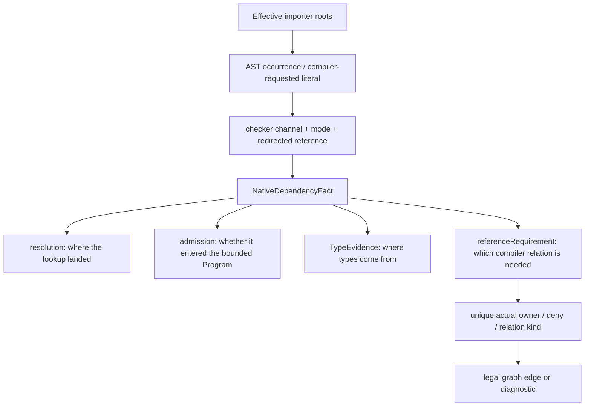

# Limina semantic facts

[English](./limina-semantics.md) | [简体中文](./zh/limina-semantics.md)

This page explains how dependency facts are produced and the limits of their capabilities. Entity and relation definitions belong to the [system model](./limina-system-model.md); properties that must not change accidentally belong to [I02–I07](./limina-invariants.md). This page describes the current adapters, without claiming complete equivalence to every version of the upstream checkers.

## From ownership candidates to a locked context

[checker-ownership-resolution](../../packages/limina/src/core/build-graph/checker-ownership-resolution.ts) performs discovery, root evidence collection, dependency fact collection, and requirements convergence before freezing semantic authority; Vue promotion, build coloring, and finalization follow. [semantic-authority](../../packages/limina/src/core/build-graph/checker-semantic-authority.ts) accepts only explicit, config, root-file, and dependency evidence for a semantic lock. Build-closure, fallback, solution-constraint, and vue-promotion do not rewrite semantics.

Pending discovery uses the bounded native TypeScript context from [pending-facts](../../packages/limina/src/core/build-graph/checker-ownership-pending-facts.ts). Only a missing path can enter [physical candidate](../../packages/limina/src/core/build-graph/checker-ownership-physical-candidate.ts) bootstrapping: Oxc supplies a physical candidate, but a known framework extension, governed effective membership, a unique config, and a semantic domain are also required to form an ownership requirement. An ordinary TS/resource path does not lock a framework merely because a physical lookup succeeds.

A locked [ProjectSemanticContext](../../packages/limina/src/core/project-dependencies/contracts.ts) requires `LockedSemanticAuthority` at the type level. It has a different entry point from pending discovery. Copying authority in a constructor is not complete runtime authentication of an arbitrary forged JavaScript object. Production calls are constrained by the solving flow and type boundary; this must not be described as an unforgeable security capability.

## Native semantic inputs for a project

[effective-roots](../../packages/limina/src/core/typescript-semantic/effective-roots.ts) uses the checker's parsed roots and resolves relative entries in effective `compilerOptions.types` to produce deduplicated importer roots. Declaration files may be roots. `ownedFileNames` serves ownership and coverage; transitive Program files serve type interpretation. Neither can replace importer enumeration.

[context](../../packages/limina/src/core/typescript-semantic/context.ts) builds a full bounded Program by default. The [project-dependencies provider](../../packages/limina/src/core/project-dependencies/provider.ts) creates one context per uncached collection, processes all roots, captures a snapshot, and disposes it in `finally`. It neither selects `root-facts` nor creates a Program per occurrence. Root-facts is a separate, narrower admission mode and does not describe the production locked provider.

The [admission ledger](../../packages/limina/src/core/typescript-semantic/admission.ts) admits effective roots, raw project references, explicit path/type references, libs, allowed external module targets, and declaration closures by reason. The resolver can find an ordinary workspace module target without admitting it into the Program. Relative declaration closures from external declaration importers still pass through the workspace source boundary incrementally. That boundary matches both lexical and realpath identities and provides only Boolean membership, without owner, provenance, or policy.

Raw references come from the user's source/resolver config. References inferred by the generated graph do not feed back into this input: otherwise a new relation would change the evidence that produced it and justify itself. `resolveJsonModule`, explicit roots, reference inputs, and external library inputs remain subject to their respective TypeScript and ledger conditions; this cannot be summarized as “all non-root files are rejected.”

## Occurrences, evidence, and graph requirements

The four fact fields in the diagram are parallel dimensions. Following the arrows must not turn a path, Program membership, and type provision into synonyms. [import-resolver](../../packages/limina/src/core/typescript-semantic/import-resolver.ts) and [module-records](../../packages/limina/src/core/typescript-semantic/module-records.ts) record occurrence mode and redirected references; triple-slash path, types, and libs use their respective compiler channels. JSX synthetic literals are recorded only when TypeScript actually requests them, not merely from the `jsx` field. Under the same configuration, preserve may also request the JSX type runtime.

Key combinations in [dependency-fact](../../packages/limina/src/core/typescript-semantic/dependency-fact.ts):

| Condition                                                                                                     | TypeEvidence                                                 | referenceRequirement                                              | Interpretation                                                                                               |
| ------------------------------------------------------------------------------------------------------------- | ------------------------------------------------------------ | ----------------------------------------------------------------- | ------------------------------------------------------------------------------------------------------------ |
| Resolves to a concrete declaration                                                                            | concrete-declaration                                         | null                                                              | Types already cross an artifact boundary; do not infer a source reference backward                           |
| The checker resolves to a source implementation                                                               | checker-source, or ambient when the actual symbol is ambient | source-semantic, or determined by the membership conditions below | The target suffix cannot override the checker symbol                                                         |
| Ambient symbol + non-external implementation, with the target outside existing compiler root/reference inputs | ambient                                                      | compiler-membership                                               | Ambient provides the types, but the compiler relation still lacks membership; both facts hold                |
| Ambient-only, an already covered target, or an external case                                                  | ambient                                                      | null                                                              | Ambient provision alone does not create a source edge                                                        |
| Module augmentation associated with a source-file symbol                                                      | checker-source                                               | source-semantic                                                   | Augmentation does not demote a real source module to ambient-only                                            |
| No target and no type evidence                                                                                | missing                                                      | null                                                              | Later stages may classify an observation or failure; a runtime resource cannot manufacture a semantic target |

[native-reference-repair.spec.ts](../../packages/limina/src/__tests__/native-reference-repair.spec.ts) covers these distinctions. [generated-graph.spec.ts](../../packages/limina/src/__tests__/generated-graph.spec.ts) connects the facts to the actual declaration graph and differential compiler observations. A `resource` observation may contain only runtime classification or may carry ambient TypeEvidence. Reading observation.kind does not determine TypeEvidence.kind.

Ordinary runtime-like import inspection has a separate TypeScript syntax pass and Oxc resolver route. Those APIs do not share every restriction of the locked checker. Native CommonJS recognition checks lexical bindings: shadowed `require` is excluded, and `createRequire(import.meta.url)` is accepted only through a direct immutable binding. Mutable, indirect, computed, and similar forms are not automatically interpreted as loaders. Evidence is in [typescript-imports](../../packages/limina/src/core/import-analysis/typescript-imports.ts) and its tests.

## Locked resolution and framework preparation

The locked routes in [checker-resolution-provider](../../packages/limina/src/core/import-analysis/checker-resolution-provider.ts) set Oxc to null. A checker miss stays a miss; runtime/resource classification cannot supply a semantic target. This restriction applies to that call chain and must not be expanded into “Oxc never produces evidence anywhere in Limina analysis.”

[PreparedDependencyFact](../../packages/limina/src/core/framework-semantic/contracts.ts) preserves strict provenance from generated occurrences to source, together with checker evidence. [dependency-record](../../packages/limina/src/core/project-dependencies/dependency-record.ts) checks both the target path and TypeEvidence kind. A source/declaration kind mismatch, or a claim of source/concrete evidence without a target, cannot enter the graph. `resolvedBy` records resolution provenance; TypeEvidence records the kind of type provision. They must be recorded separately.

| Family     | Actual semantic channel                                                                                                                                                                                 | Limits that must be preserved                                                                                                                                                                                                                        |
| ---------- | ------------------------------------------------------------------------------------------------------------------------------------------------------------------------------------------------------- | ---------------------------------------------------------------------------------------------------------------------------------------------------------------------------------------------------------------------------------------------------- |
| TypeScript | Full bounded Program and native facts                                                                                                                                                                   | Provider collection enumerates effective roots; external environment closures may load without automatically becoming the importer set                                                                                                               |
| Vue        | The Vue source profile distinguishes native channels from the Vue host/service script; [resolution](../../packages/limina/src/core/vue-semantic/resolution.ts)                                          | A matching VueSemanticIdentity is required; ordinary native TS occurrences do not all need to pass through an SFC source map. Strict mapping failure cannot be repaired by arbitrarily selecting another mapping segment                             |
| Astro      | Lazy language-service Program, Astro type environment, and generated snapshots in [context](../../packages/limina/src/core/astro-semantic/context.ts); other native channels may use TS                 | Roots, config, and toolchain determine the context; being able to read an adjacent extension is not equivalent to supporting the complete framework checker                                                                                          |
| Svelte     | Leaf-owned svelte2tsx / compiler / TS, with the TS host resolving generated scripts; [module-resolution](../../packages/limina/src/core/svelte-semantic/module-resolution.ts) preserves occurrence mode | Explicit `.svelte` resolution does not pass occurrence mode. A virtual `.d.svelte.ts` maps back to source only when that source exists and no real `.svelte.d.ts` exists; real declarations take precedence, with no second package exports resolver |

The Svelte adapter covers source transformation, the generated host, strict source mapping, and that host's module resolution. It does not load the complete `svelte.config` / preprocess pipeline and cannot promise equivalence to every svelte-check configuration. Native `.ts/.js` files still use native root/fact enumeration. In the generated graph, Astro/Svelte are complete leaf typecheck targets; they do not receive declaration wrappers or transparent build solutions.

Toolchain provenance, accepted versions, and capability checks are defined by the concrete resolvers/runtimes in [checker](../../packages/limina/src/checker/) and the framework contexts. An adapter accepting a version range establishes only the code's admission conditions; tests with an installed tuple establish only that tuple's cases. Other minors, Windows, and uninstalled optional checkers still need their own validation.

Concrete tuple owners are [Vue compatibility](../../packages/limina/src/checker/vue-semantic-compatibility.ts), [Astro compatibility](../../packages/limina/src/checker/astro-semantic-compatibility.ts), and the [Svelte toolchain](../../packages/limina/src/core/svelte-semantic/toolchain.ts). Vue resolves Language Core/Volar/TypeScript from vue-tsc; Astro resolves the compiler from the check-owned Language Server. Workspace-root retries must not hide missing leaf dependencies. Paths provide provenance and instance identity, not a pnpm-layout compatibility predicate.

Svelte [source-mapping](../../packages/limina/src/core/svelte-semantic/source-mapping.ts) requires explicit segments to map every UTF-16 offset of a generated dependency continuously and monotonically to the current source. Partial coverage, cross-source mappings, or discontinuity produce a mismatch; entirely unmapped input remains an unmapped observation. [generated-script](../../packages/limina/src/core/svelte-semantic/generated-script.ts) constructs TraceMap without a map URL to avoid rebasing an absolute Windows source drive again. Vue/Astro use their own mapping algorithms for full-token/inner-content mapping, ambiguity, and mismatch; one framework's map conditions cannot be applied to all frameworks.

## Configuration projection boundaries

[compiler-overrides](../../packages/limina/src/core/build-graph/compiler-overrides.ts) and the [generated readers](../../packages/limina/src/core/build-graph/generated/) project generated roots/options from effective source config. When relative `types` entries have become explicit roots, remove relative configuration that would be reinterpreted in the generated directory. `extends` must also use effective values. Source checker authority cannot be inferred backward from generated compiler options.

At the governance layer, source type leaves may not contain handwritten `references`; the [config reader](../../packages/limina/src/core/build-graph/generated/config-reader-basics.ts) rejects that shape. Solutions aggregate projects, and `implicitRefs` records explicit dynamic/virtual relations. The lower-level semantic context supporting raw references does not relax the governed leaf shape. [generated-configs](../../packages/limina/src/core/build-graph/generated-configs.ts) points declaration outDir/declarationDir at the same managed dts root to prevent inherited output redirection. It overrides `rewriteRelativeImportExtensions` only when enabled in effective source config, avoiding unconditional introduction of an option older compilers do not recognize. Supported solutions have no outputs.

Managed-output lookup may explain where a concrete managed declaration came from, but does not turn it into a source implementation. Build coloring reads normalized referenceRequirement; framework scheduling consumes only source-semantic implementation relations. When changing these entry points, check [I03–I07](./limina-invariants.md) together rather than relying only on resolver unit tests continuing to hit the same path.
