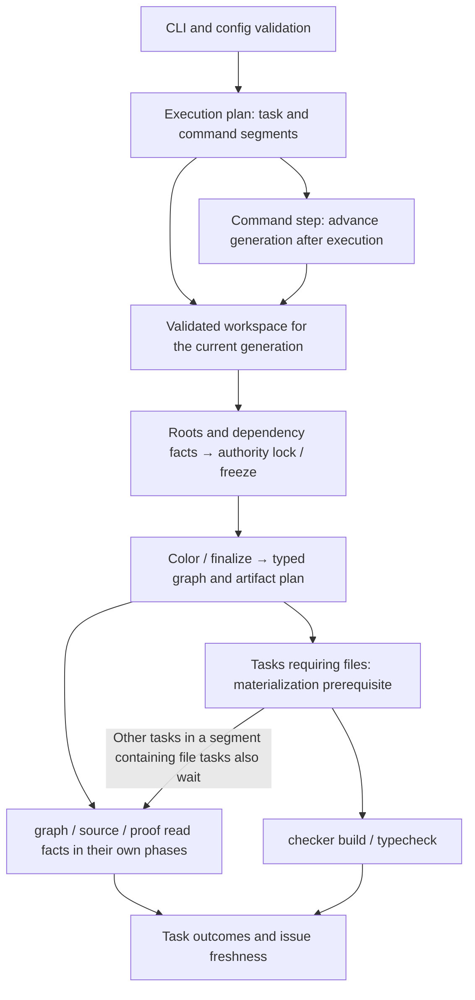

# Limina System Model

[English](./limina-system-model.md) | [简体中文](./zh/limina-system-model.md)

This page owns the definitions of entities, authority, phases, and relations. See the [entry record](./limina.md) for evidence levels and maintenance rules. The model follows the current production call chain; a directory name or an abstraction that is not wired in is not execution evidence.

## System boundaries and actual entry points

`bin/limina.js` starts the CLI through tsx when source is present, or starts the built CLI otherwise; the [factory](../../packages/limina/src/cli/factory.ts) registers commands. Commands call the respective pipeline, graph/source/proof/checker/package/release runners. Preflight aggregates workspace, graph, and route snapshots for the current generation; the executor schedules task order, resources, and generations. Checker toolchains perform type checking and declaration compilation; Limina interprets inputs, projects configuration, validates relations, and manages its artifacts.

[AnalysisRun](../../packages/limina/src/application/analysis/analysis-run.ts) and [AnalysisProviderSet](../../packages/limina/src/core/index.ts) participate in production preflight. The typed registry, views, and validators in [ArchitectureValidationWorkflow](../../packages/limina/src/application/validation/architecture-workflow.ts) have their own implementation and tests, but the current production caller search found no consumer of that workflow. The graph/source/proof runners still organize their own phases. A diagram must therefore not claim that the CLI centrally executes the registry's seven validators. This is the current wiring boundary; whether to unify it remains an open design question.

## Entities and identity

| Entity                     | Identity / creation site                                                                                                                                                                                                   | What it owns, and what cannot be inferred from it                                                                                                                                                         |
| -------------------------- | -------------------------------------------------------------------------------------------------------------------------------------------------------------------------------------------------------------------------- | --------------------------------------------------------------------------------------------------------------------------------------------------------------------------------------------------------- |
| Workspace / region         | Workspace root located by the loader, validated region boundaries                                                                                                                                                          | The package-manager discovery scope is not automatically the governance scope; nested workspaces, package scopes, and exclusions participate in boundary selection                                        |
| WorkspacePackage           | Logical package directory + [canonical identity](../../packages/limina/src/core/workspace/validated/package-identities.ts); name is optional                                                                               | Raw and activated packages are separate; duplicate aliases of one physical package are rejected. Name-dependent graph export separately requires a name                                                   |
| Source config              | Normalized absolute config path; [config-paths](../../packages/limina/src/core/tsconfig/config-paths.ts)                                                                                                                   | Config is the checker ownership unit. `normalizeAbsolutePath` is a lexical portable path operation; it does not establish that all tsconfig symlink aliases have been merged through realpath             |
| Type / solution config     | [solution-role](../../packages/limina/src/core/tsconfig/solution-role.ts) and ownership state                                                                                                                              | A solution with empty effective files and raw references organizes the closure; Limina supports the solution basename `tsconfig.json`; type leaves have semantic and execution owners                     |
| Checker identity           | Exact checker name in the [registry](../../packages/limina/src/checker/registry.ts)                                                                                                                                        | The execution identities `tsc`, `tsgo`, and `vue-tsc` are not equivalent to semantic families such as TypeScript or Vue                                                                                   |
| Ownership state            | [checker-ownership-types](../../packages/limina/src/core/build-graph/checker-ownership-types.ts)                                                                                                                           | authoritativeOwner, localOwner, semanticAuthority, frozenSemanticAuthority, and finalOwner have distinct phases; they are not aliases of one owner field                                                  |
| ProjectSemanticContext     | [context](../../packages/limina/src/core/project-dependencies/context.ts): config/options/roots/raw refs/family/package/toolchain/generation                                                                               | Semantic interpretation environment for locked type inputs; `fileNames` contains importer roots, `ownedFileNames` serves actual ownership, and Program files form the compilation closure                 |
| ImportRecord               | [records](../../packages/limina/src/core/import-analysis/records.ts): file + kind + locator + specifier                                                                                                                    | One string can have multiple occurrences. Resolution identity additionally includes context, mode, and redirected reference; a specifier alone is not a sufficient cache key                              |
| Native / prepared fact     | [dependency-fact](../../packages/limina/src/core/typescript-semantic/dependency-fact.ts), [framework contracts](../../packages/limina/src/core/framework-semantic/contracts.ts)                                            | resolution, admission, TypeEvidence, referenceRequirement, and provenance retain distinct meanings; a fact is not a final graph edge                                                                      |
| Generated graph / target   | [graph result](../../packages/limina/src/core/build-graph/runner.ts), [dependency plan](../../packages/limina/src/typecheck/build/dependency-plan.ts)                                                                      | source→generated/config role/owner/typed edges; execution targets match checker + source config + generated config and cannot be merged by file or package name alone                                     |
| Namespace / plan / receipt | [namespace](../../packages/limina/src/domain/artifacts/namespace-core.ts), [plan](../../packages/limina/src/domain/artifacts/plan.ts), [preflight materialization](../../packages/limina/src/preflight/materialization.ts) | Namespace tokens, plan authenticity, revision, and receipt slots guard different stale/forged states; equal generation numbers do not grant authority                                                     |
| Finding / issue / attempt  | Domain finding → issue projector; [attempt IO](../../packages/limina/src/source-check/snapshot/check-attempt-io.ts)                                                                                                        | Issue identity supports stable deduplication; attempt ID + sequence + completion digest establish query freshness. Domain GovernanceIssue cannot unconditionally be treated as persisted LiminaCheckIssue |

Checker entry selection and leaf reachability are separate. `checker.include` selects default `tsconfig.json` entries; named terminal configs enter through their effective references closure. Nested solutions also require the default basename. Selecting a named leaf directly does not repair a missing provider reference. [CLI selection tests](../../packages/limina/integration/tests/named-leaf-selection.spec.ts) cover direct-selector rejection, default nested/direct-reference success, and named intermediate-solution rejection.

## Six dimensions of authority

| Dimension           | Source                                                                                                                                        | Rejected inference across dimensions                                                                       |
| ------------------- | --------------------------------------------------------------------------------------------------------------------------------------------- | ---------------------------------------------------------------------------------------------------------- |
| Workspace authority | [validated create](../../packages/limina/src/core/workspace/validated/create.ts): raw discovery → exclusions/overlap/islands/output authority | Finding a package through a manager adapter does not prove that it is governed in this run                 |
| Semantic authority  | Explicit/config/root/dependency evidence locked during ownership resolution                                                                   | Ultimately building with vue-tsc does not change parsing to Vue semantics                                  |
| Execution ownership | Explicit leaf closure, equality coloring, fallback, finalization                                                                              | Build identity does not prove that a runtime import is authorized by the package                           |
| Source ownership    | Actual root membership, validated package/source rules                                                                                        | Nearest directory, export names, and an Oxc file hit cannot substitute for the actual owner                |
| Artifact authority  | Namespace/authenticated plan/revision and managed-output attribution                                                                          | Reverse output attribution does not recreate a source reference; an output path is not permission to write |
| Mutation authority  | Physical identity of the trusted base, scope, generation, path/identity guards                                                                | Lexical containment is insufficient; planning a write does not authorize following a symlink elsewhere     |

A project may have TypeScript semantic authority, a `vue-tsc` final owner, a source package owner, and separate output authority. This is a valid combination. [I01–I12](./limina-invariants.md) explain which transitions are protected.

## Workspace discovery authority

The shared [root resolver](../../packages/limina/src/utils/workspace-root.ts) supplies config loading, package discovery, validated context, issue lookup, and init. Search distance wins across descriptor types; `pnpm-workspace.yaml` wins only within one directory. An ordinary manifest does not stop ancestry search. Syntax errors and uninterpretable explicit identities fail closed. There is no single-package fallback.

For pnpm, YAML supplies workspace authority and an explicit different manager is a conflict. For `package.json#workspaces`, an own `packageManager` supplies identity; only its absence allows same-directory lockfiles as fallback. Lockfiles are deduplicated by manager, ambiguity is checked before the pnpm-missing-descriptor error, and no ancestor lockfile is consulted. The resolver recognizes identity, not semver validity or installability. Declaration parsing remains in the [manager adapters](../../packages/limina/src/core/workspace/selection-policy.ts): pnpm consumes only `packages`, npm accepts an array, and Yarn/Bun accept an array or an object containing a packages array. Unrelated catalogs and manager settings are not Limina discovery schema.

The adapters supply distinct traversal hard ignores: pnpm excludes `node_modules` and `bower_components`; npm excludes `node_modules`; Yarn excludes `node_modules`, `.git`, and `.yarn`; Bun excludes `node_modules`, `.git`, and `CMakeFiles`. `test/tests` are not private exclusions. The [shared expansion](../../packages/limina/src/core/workspace/expand-package-globs.ts) enumerates directories, then discovery reads manifests and independently merges the root manifest when present. Missing manifests are skipped; invalid JSON fails; nameless packages remain valid. Named-first ordering is unchanged. The filesystem adapter preserves directory-link aliases, including an ancestor-pointing directory itself, and only stops recursive descent at a cycle. Cycle state belongs to one expansion group. Physical deduplication belongs to validation, where aliases must cause identity conflicts after workspace-overlap checks.

Shared traversal does not imply equivalent manager glob semantics. [Selection patterns](../../packages/limina/src/core/workspace/selection-patterns.ts) carry npm's cancellation of earlier matching exclusions and Bun's ordered selection / trailing-globstar behavior. Exact pnpm/npm/Bun package exclusions filter selected directories without pruning unmatched descendants; manager hard ignores still prune traversal. These are bounded compatibility rules, not a promise of universal equivalence across manager versions. Although the explicit `packageManager` syntax is parsed as `manager@version`, `ResolvedWorkspaceRoot` retains only the manager identity and no discovery adapter branches on the declared version. Limina therefore applies one documented discovery projection per manager rather than emulating historical release profiles. Historical discovery behavior that upstream later classifies and corrects as a fix is outside this compatibility contract; declaring the affected older version does not re-enable that behavior. The supported npm projection deliberately rejects object form even where npm itself accepts it. The required Yarn/Bun hard-ignore policies also remain effective for explicit metadata-directory patterns that Yarn 4.18.0 or Bun 1.3.13 can accept. Bun dynamic patterns follow its hidden-directory behavior; explicit directory declarations can name `.yarn` without borrowing Yarn's policy.

A nested YAML descriptor or own `package.json#workspaces` forms a `workspace-root` boundary even without a resolvable nested manager. It is never a configurable `package-scope` candidate and cannot be crossed by `extendNestedPackageScopes`. Same-root overlap uses the actual descriptor path. `ValidatedWorkspaceContext.workspaceRoot` retains manager and descriptor metadata; `workspaceRootDir` remains a compatibility field. The pnpm-only catalog lookup in init's package metadata reader describes Limina's own development package, not the user's workspace authority.

The package-island walk follows symlinks only for descriptor files (`package.json` and `pnpm-workspace.yaml`). Their lexical location establishes the boundary; canonical identity records the target separately. Missing or non-file targets fail discovery instead of silently admitting the containing subtree. Directory symlinks do not gain recursive traversal through this rule, and linked tsconfig files do not gain source-config admission.

Executable guards: [workspace discovery](../../packages/limina/src/__tests__/workspace-discovery.spec.ts), [workspace validation](../../packages/limina/src/__tests__/workspace-validation.spec.ts), [config](../../packages/limina/src/__tests__/config.spec.ts), and [init](../../packages/limina/src/__tests__/init.spec.ts). The 2026-09-21 differential scope uses pnpm 11.9.0, npm 12.0.2, Yarn 4.18.0, and Bun 1.3.13 on macOS; other releases/platforms remain unverified. No human vouch is implied.

## Internal query index for validated regions

[WorkspaceRegionPathIndex](../../packages/limina/src/core/workspace/validated/path-index.ts) consumes only the final `ValidatedWorkspaceContext`. Validation establishes activated package identities, stable boundaries, and source configs; the [index builder](../../packages/limina/src/core/workspace/validated/path-index-build.ts) does not rescan manifests/workspaces or reinterpret exclusions or extended scopes. Otherwise, a query could regrant authority already excluded by validation.

Runtime activated-package and boundary authority comes only from this trie-backed index, directly or through [WorkspaceLookupIndex](../../packages/limina/src/core/workspace/lookup/workspace-index.ts). Its package/owner lookup selects the exact directory returned by classification; it never falls back to the nearest containing package or owner. A boundary result remains null ownership even when the file is physically below an activated ancestor. Internal exports must not retain package-array or owner-array classifiers as compatibility aliases.

This index serves frequent file-level membership predicates. Within one provider, [source candidate collection](../../packages/limina/src/core/workspace/file-candidates.ts) filters individual files, while [graph check](../../packages/limina/src/graph-check/check-context.ts) and [source check](../../packages/limina/src/source-check/source-projects.ts) filter project fileNames / ownedFileNames respectively. [Owned-source validation](../../packages/limina/src/core/build-graph/source-projects.ts), [framework source roots](../../packages/limina/src/core/build-graph/framework-file-root.ts), [source config ownership](../../packages/limina/src/core/build-graph/source-config-collection.ts), and [local import governance](../../packages/limina/src/source-check/import-record-validation.ts) also depend on these classifications. Downstream stages repeatedly query classifyPath, isInsideActivatedRegion, findPackageForPath, isSourceConfigPath, or the lookup facade on the same index. Evaluation must therefore include the first classification of a whole batch of new files, exact-cache reuse across steps, and total provider lifetime cost. A single cwd query remains a real boundary case, but does not represent the main calling pattern of these governance flows.

The [governance trie](../../packages/limina/src/core/workspace/validated/governance-trie.ts) encodes canonical package roots as activations and stable boundary roots as owner-scoped cuts using their original lexical owner attribution. Its virtual root preserves the absolute root/drive, so activated packages outside the config root can still match. DFS selects the activation before applying cuts, storing the effective owner and concrete boundary directly on each node. Queries take the longest match along complete path segments; source directories and every node_modules directory do not need their own nodes.

For example, A activation → B cut(A) → C activation → D cut(C) produces A, boundary B, C, and boundary D in the four subtrees. DFS still preserves the attribution of the nearest activated identity: if a deeper cut(A) follows B, diagnostics must return that deeper boundary rather than miss it because B already cleared the effective owner. Saving and restoring owner cuts along a branch also covers a symlink projecting a cut's canonical root above its owner's activation. Attribution identity is not current governance authority; the boundary still makes that owner's classification return null.

Each node stores one path segment. A Map is allocated only for multiple children; a single child is linked directly, and owner/boundary data is stored inline. This reduces retained objects in sparse chains without introducing radix compression or a second query backend. Activation/cut event tables and the DFS attribution stack exist only during construction. A model with 200–300 packages, few boundaries, and deep source directories is representative for performance evaluation; dense boundaries still require separate stress checks. Visit counts or one sample cannot characterize every runtime cost.

The lexical exact cache remains before canonicalization; only a miss uses the existing canonicalProjectedPathSync and instance canonical cache. Source configs still have a separate canonical Set and first require the file to be inside an activated region; the trie does not participate in lexical importer matching. `workspace-path-trie-segment-visit` counts attempted segment lookups, including the first missing segment, and is no longer named as an ancestor visit. Public classification fields, concrete boundary objects, and negative-result caching remain unchanged.

Other path algorithms retain separate responsibilities: the builder attributes boundary cuts before publishing the trie; candidate glob ignores prune enumeration before final index membership checks; importer matching stays lexical; project ownership and known-package artifact/config grouping remain local relations. [Package-scope lookup](../../packages/limina/src/core/workspace/lookup/package-scope.ts) first obtains the activated package from the trie, then searches for a manifest. Before walking ancestors, it uses the query and selected root's canonical paths to translate the query into the package's retained lexical directory. The walk and its stopping root therefore share one path spelling, including when an alias points directly into a subdirectory or the query has a missing tail. A nameless activated root ends named-scope lookup with null; it cannot borrow an outside ancestor's name. Returned manifest paths retain the package identity used by the exact package-path map. This translation follows trie admission and does not select another owner; inactive paths remain rejected, and the separate node_modules lookup keeps its lexical search. [Package-scope guards](../../packages/limina/src/__tests__/workspace-package-scope.spec.ts) cover both alias directions, query/cache order, nested scopes, boundary rejection, and the resolved-target facade.

Executable boundaries are protected by the test-only linear oracle for trie semantic equivalence, direct package/owner facade comparisons across cuts and re-entry, re-entry/same-root events/canonical relocation/cache/error cases, and deep-directory stopping conditions in [workspace directory index tests](../../packages/limina/src/__tests__/workspace-directory-index.spec.ts). [Workspace validation tests](../../packages/limina/src/__tests__/workspace-validation.spec.ts) check final governance facts and metrics. See the [lifecycle record](./limina-lifecycle.md#cache-identity-and-capability-scope) for index lifetime.

[FileOwnerLookup](../../packages/limina/src/core/build-graph/file-owner-lookup.ts) independently indexes registered file ownership for build-graph consumers. Effective membership supplies pending qualification, ownership dependencies, and coloring; governed owned files supply declaration selection and framework scheduling. Exact lexical hits retain existing overlap rules. Only a miss consults canonical identity; the fallback returns every registered config, deduplicates by config, accepts a unique owner, and reports ambiguity instead of choosing the deepest directory. It also returns owner-registered paths for `ownedFileNames` and Vue profile matching, while resolution, occurrences, and diagnostics retain the original lexical spelling. No directory walk invents an owner and WorkspaceSourceBoundary remains a Boolean membership boundary. [Owner lookup tests](../../packages/limina/src/__tests__/file-owner-lookup.spec.ts) cover both alias directions, exact/fallback collisions, query order, cross-checker provider matching, and fresh indexes after alias changes; [generated graph tests](../../packages/limina/src/__tests__/generated-graph.spec.ts) exercise relation consumers.

## Pipeline and phase contracts

Arrows express dependencies, not universal serial execution. [Steps](../../packages/limina/src/pipeline/steps.ts) defines five default task kinds: graph/source/proof/checker build/checker typecheck. The [plan](../../packages/limina/src/pipeline/plan.ts) marks default tasks independent and named pipelines ordered. `after` waits for settlement; `requiresSuccessOf` requires success. Commands divide generations; a segment requiring files receives a materialization prerequisite, and that segment's tasks wait for it to succeed. The user's root `lib` pipeline is a configuration choice, not the default pipeline.

| Phase                     | Valid input → output                                                                                                        | Facts not yet available / failure boundary                                                                                                                                                              |
| ------------------------- | --------------------------------------------------------------------------------------------------------------------------- | ------------------------------------------------------------------------------------------------------------------------------------------------------------------------------------------------------- |
| Load / validate           | Config export + root → normalized config/validated plan                                                                     | Schema/config failure can precede attempt publication; not every CLI failure is guaranteed to have a new inventory                                                                                      |
| Workspace validation      | Raw package/config candidates → ValidatedWorkspaceContext                                                                   | Overlap, duplicate physical packages, or invalid scope/output authority block downstream projection; rawPackages remains original evidence                                                              |
| Ownership discovery       | Default entries, raw references, named scopes → type/solution states                                                        | Named solution authoritative closure already participates here; not all solution constraints occur after freeze                                                                                         |
| Evidence convergence      | Pending native facts / locked checker facts → complete dependency requirement set, locked semantic family                   | Collect all pending requirements before applying dependency locks so that the first import cannot hide a cross-framework conflict                                                                       |
| Freeze / color / finalize | Locked semantic facts → frozen authority, exact owner, solution closure, checker entries                                    | [Resolution](../../packages/limina/src/core/build-graph/checker-ownership-resolution.ts) freezes before Vue promotion / build coloring / finalization; later phases may change only execution ownership |
| Graph projection          | Requirements + actual source membership + implicit refs → declaration / framework relations, generated files, artifact plan | Missing unique owners, deny rules, and checker identity conflicts cannot be repaired with nearest-directory guesses or a weaker resolver                                                                |
| Validation                | Graph/route/source evidence → domain findings, issues/outcomes                                                              | graph, source, and proof have their own prerequisite phases; proof route/config failures limit subsequent coverage judgments                                                                            |
| Materialize / checker     | Authenticated plan/authority → files/receipt → external checker outcome                                                     | An in-memory graph does not establish disk completion; artifact publication and checker process exit are reported separately                                                                            |
| Complete / query          | Settled outcomes → authenticated terminal attempt state                                                                     | Query reads existing state without rerunning; the latest failure must not disguise an older completed inventory as a new result                                                                         |

## Relation taxonomy

| Relation                     | Producer / meaning                                                                                           | Downstream permissions and boundaries                                                                                         |
| ---------------------------- | ------------------------------------------------------------------------------------------------------------ | ----------------------------------------------------------------------------------------------------------------------------- |
| raw tsconfig reference       | TypeScript input relation from source config                                                                 | May affect native semantics and solution closure; inferred/generated refs do not feed back into this input                    |
| solution-leaf equality       | Solution terminal leaf closure                                                                               | Participates in build identity equality; does not require an earlier import occurrence                                        |
| native occurrence resolution | TS module/path/type/lib/JSX channels                                                                         | Establishes only that occurrence's interpretation; admission and TypeEvidence remain separate                                 |
| referenceRequirement         | NativeDependencyFact source-semantic / compiler-membership                                                   | Evidence that a compiler relationship is needed; still requires membership, deny, identity, and graph classification          |
| `implicitRefs`               | Config relation declared in the user's liminaOptions                                                         | Can generate references under its own validity constraints; does not require invented import evidence                         |
| declaration-provider         | [reference-recording](../../packages/limina/src/core/build-graph/reference-recording.ts)                     | Generates TypeScript references and declaration build dependencies; successful edges share the exact checker and are reusable |
| framework-schedule           | [framework-reference-inference](../../packages/limina/src/core/build-graph/framework-reference-inference.ts) | Proven source implementation ordering; generates no tsconfig reference and grants no declaration cache reuse                  |
| output/artifact attribution  | Managed output lookup and output declarations                                                                | Supports concrete declaration evidence/diagnostics; cannot reverse-infer source edges                                         |
| configured governance rule   | Graph labels/rules, source package/import/ambient policy, proof boundaries                                   | Can judge observed relations invalid; cannot create missing compiler facts                                                    |
| exported dependency edge     | Package source/artifact evidence from [dependency-graph](../../packages/limina/src/dependency-graph/)        | Architecture observation; the export schema lacks a complete task/resource/cache model and is not an execution plan           |

Package dependency and deny-dependency checks resolve both ends of a generated reference through each project's original `resolverConfigPath`. Generated `.limina` paths retain graph and diagnostic identity, but cannot supply package/importer identity. This applies to `implicitRefs` even when no source import exists, and retains nameless-package checks. [Graph regressions](../../packages/limina/src/__tests__/graph.spec.ts) exercise declared, undeclared, denied and nameless endpoints with an activated root control.

Declaration targets `.d.ts/.d.mts/.d.cts` are artifact endpoints. Even a source file's existence is insufficient without a valid requirement. The execution dependency plan sees both declaration and scheduling edges; it first filters dependencies on the same target. An SCC of two or more targets containing a declaration relation is rejected, while a pure framework SCC can execute. See [graph-validation](../../packages/limina/src/core/build-graph/graph-validation.ts) and [declaration-cycle](../../packages/limina/src/typecheck/build/declaration-cycle.ts) for the exact guards.

## Failure semantics and projection boundaries

Invalid config/namespace/authority generally throws directly. Unsupported semantic preparation or untrustworthy source mapping becomes a stage-specific failure; missing modules, resources, and unmapped generated dependencies can become observations. `resource` is not TypeEvidence, and missing does not mean an exception. graph/source/proof decide within their own domains whether these facts constitute an issue.

The graph runner validates relations, rules, and condition/export constraints; the source runner validates ownership and package import/dependency/ambient rules and can incorporate Knip; the proof runner compares expected source with checker coverage; the package runner checks configured outputs; the release runner checks release consistency. Optional tools and configuration determine coverage. Passing one domain does not prove that others pass. Entry evidence: [graph](../../packages/limina/src/graph-check/runner.ts), [source](../../packages/limina/src/source-check/runner.ts), [proof](../../packages/limina/src/proof/runner.ts), [package](../../packages/limina/src/package-check/runner.ts).

Source resource checks separately ask whether a physical file exists, whether its types are declared, and whether the package import is authorized. [resource-module-findings](../../packages/limina/src/source-check/resource-module-findings.ts) checks the module specifier exactly as written: `package.json#imports` keys keep their `?`/`#`, and an ordinary specifier is never split at a query or fragment to inspect another physical path, so a queried import yields no resource finding on the basis of its suffix. Paths are normalized when writing issues. Proof allowlists carry reasons and are checked against scope/existing coverage; they are explicit configuration exceptions, not evidence that a checker actually read the file. Package checks evaluate Publint/ATTW/boundary results for configured entries, not automatically every raw workspace package. Resource observations retain their occurrence's resolver mode, including native ambient observations and mapped framework facts. Physical package-resource lookup uses a dedicated Oxc resolver with exactly the occurrence's import or require condition plus custom conditions; its caches include purpose, mode, conditions and symlink policy and are disposed after source checking. The resolver never supplies TypeEvidence or compiler references. Exact package-import keys containing `?` or `#` use Node with the same mode and conditions because Oxc's query parsing can reinterpret those keys. Mappings containing null targets also use Node, since this Oxc version can fall through an active null branch to default; this compatibility probe resolves without loading a module. Virtual/unsupported resource boundaries remain classified before physical lookup. [Conditional resource tests](../../packages/limina/src/__tests__/resource-resolution-conditions.spec.ts) exercise both modes, cache reuse, custom conditions and null/missing branches.

The executor distinguishes task outcomes such as passed, failed, disabled, blocked, and skipped; stop policy, prerequisites, and infrastructure errors have separate handling. Issue presentation and completed inventory must not turn “not run” or “data unavailable” into “zero issues.” Exact states are defined in [tasks](../../packages/limina/src/execution/tasks.ts), [execution-results](../../packages/limina/src/execution/execution-results.ts), and [snapshot types](../../packages/limina/src/source-check/snapshot/types.ts).

Workspace exports preflight validates declared entry resolution against active checker profiles before source occurrences are checked. Unimported missing runtime/type entries can fail; a resolvable runtime-only JavaScript entry can pass without stable type evidence until governed source imports it. The occurrence check then requires stable type or checker-source resolution. Neither preflight nor a runtime hit establishes a compiler reference. [Public CLI regressions](../../packages/limina/integration/tests/workspace-exports.spec.ts) cover no-import missing entries and valid source/runtime controls.

Export pattern discovery enumerates package files and interprets the target as a literal string with star substitution: one capture may span directories, and every target star receives that same capture. Glob metacharacters in a target remain literal. Discovery only produces candidates; the original exports condition tree, null branches, and key precedence remain resolver authority. [Node comparison tests](../../packages/limina/src/__tests__/workspace-export-patterns.spec.ts) cover nested captures, repeated stars, literal brackets, and rejection of empty captures.

A stable export type entry requires a successful native TypeScript resolver result or a successful resolver call through the profile's Vue, Astro, or Svelte semantic adapter. A legacy physical checker-source candidate and a file found by walking flattened export targets are insufficient. Internal outcomes retain native, framework, and unresolved provenance; the public index and snapshot schema stay unchanged. Framework resolver contexts are disposed when index construction finishes or fails. This preflight probe neither creates a source occurrence nor provides TypeEvidence or build ownership. [Resolver proof tests](../../packages/limina/src/__tests__/workspace-export-resolution.spec.ts) compare native results with TypeScript across inactive/null/custom conditions, illegal targets, and unsupported suffixes. Conditional behavior follows the selected toolchain version; older Vue/TypeScript combinations can differ from TypeScript 6 for a null types branch followed by a default entry.

Exported dependency edges prioritize actual source ownership over directory spelling. Only targets under validated workspace output roots become artifact edges; these roots share the workspace path index canonicalization. The exporter does not treat `dist` as evidence and does not infer compiler relations from output attribution. [Graph projection tests](../../packages/limina/src/__tests__/dependency-graph.spec.ts) cover custom/nested outputs, source in `dist`, undeclared output candidates, and all three views.

Release content policy is evaluated per importer/dependency edge. The [dependency traversal](../../packages/limina/src/package-check/release/workspace/dependencies.ts) uses package visitation only to bound recursion; raw registry metadata can be reused, but an earlier importer’s baseline/ignore conclusion cannot authorize another edge. [Policy regression tests](../../packages/limina/src/__tests__/release-workspace-policy.spec.ts) cover diamonds, reversed order, direct/transitive overlap and cycles.

Release tarball hygiene derives comment positions from the TypeScript JavaScript parse tree, not a standalone scanner. [Comment inspection](../../packages/limina/src/package-check/release/source-map-comments.ts) rejects parse failures explicitly; template and regular-expression text cannot stand in for comments. [Regression cases](../../packages/limina/src/__tests__/source-map-comments.spec.ts) cover interpolation, nested templates, actual expression comments and literal counterexamples. The parser supplies comment classification, not a guarantee that Node consumes every block-form map directive.

Optional analyzer absence and installed-tool failure are separate outcomes. [Peer loading](../../packages/limina/src/package-check/peer-tools.ts) probes package metadata from the same ESM module origin and conditions after a load error; an unexported metadata subpath proves package presence. Only package-not-found becomes the existing optional skip result. Initialization, syntax, missing entry and transitive dependency failures keep their original error and fail package checking. [Isolated loader tests](../../packages/limina/src/__tests__/package-peer-loading.spec.ts) use real fixture packages and both import/require conditions for Publint and ATTW.

Packed publish dependency ranges use semver’s default prerelease admission. [Manifest validation](../../packages/limina/src/package-check/release/packed/manifest.ts) does not globally enable `includePrerelease`; an explicit prerelease comparator admits only its semver-defined series. [Range regressions](../../packages/limina/src/__tests__/release-prerelease-ranges.spec.ts) cover all three publish dependency sections, stable versions, explicit opt-in and a different prerelease series.
