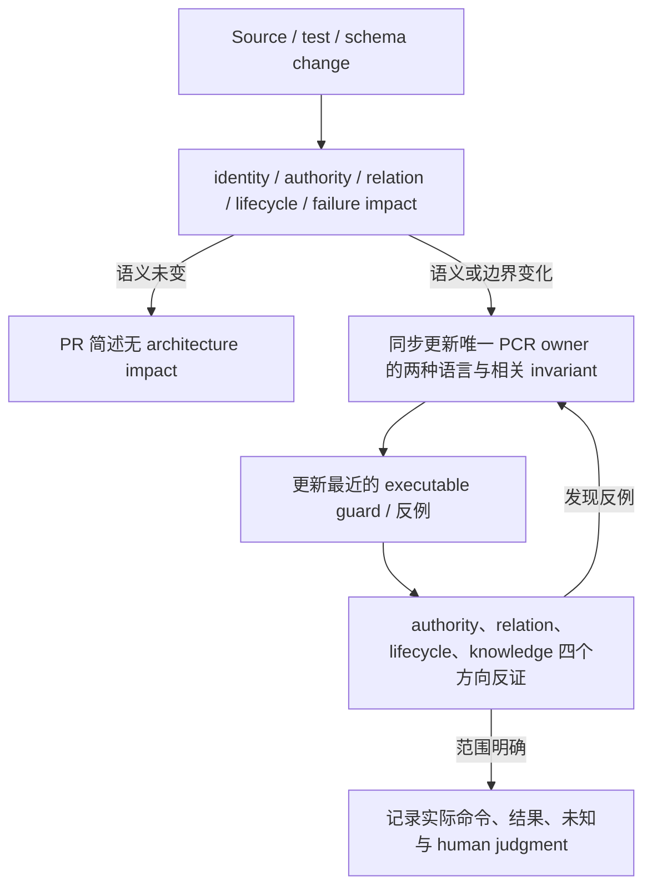

# Limina Architecture Review 与维护

[English](../limina-architecture-workflow.md) | [简体中文](./limina-architecture-workflow.md)

本页定义本次建立的 repo-native 工作机制。它是维护建议与本仓库的操作约定，不是由源码推得的历史设计意图。入口为 [limina.md](./limina.md)，不另建 docs/architecture 或 ADR 副本。

## PR 先说明 invariant impact

先保留 `git status --short` 的 index/worktree baseline，读取最近的 AGENTS 与 owning PCR；以当前改动后的代码重建受影响链路，再核对旧 prose。用一个具体 trigger 解释 before/after，按下表定位影响。

| 修改入口                                                                        | 必须追踪到的消费者                                                        | Invariants / prose owner                        |
| ------------------------------------------------------------------------------- | ------------------------------------------------------------------------- | ----------------------------------------------- |
| workspace discovery、regions、exclude、package identity、output scopes          | ownership、graph/source/proof、mutation authority                         | I01/I08/I10；system model / lifecycle           |
| checker selection、semantic authority、pending/final owner、solution closure    | facts、coloring、checker target、proof                                    | I02/I04/I07/I08；system model / semantics       |
| roots、tsconfig options/extends/types、module resolution、source maps           | occurrence identity、TypeEvidence、referenceRequirement、graph projection | I03/I04/I05/I06；semantics                      |
| reference inference、implicitRefs、output attribution、edge type                | coloring、generated config、SCC、checker plan、export view                | I06/I07；system model                           |
| cache key、provider/context ownership、async preparation、executor command step | invalidation、dispose、receipt、snapshot freshness                        | I09/I12；lifecycle                              |
| namespace、materializer、managed output、migration                              | physical authority、revision、partial failure、recovery                   | I10/I11；lifecycle                              |
| findings、issue identity、query、snapshot/schema                                | dedup、terminal/machine output、latest/standalone freshness               | I12；lifecycle                                  |
| 公开 commands/config/package exports/checker tuple                              | schema、docs、tool availability、release/package contract                 | 入口 + 相关 owner；按 observable 决定 invariant |

review 必须回答具体问题，而不是勾选“架构没有影响”：

1. 输入、identity、authority 的创建者是否变化？哪个字段已经 final，哪个仍 pending？是否把 runtime 路径升级成 checker evidence？
2. producer 与 consumer 是否仍使用同一个 relation 含义？source ownership、compiler membership、declaration reference、scheduling、artifact attribution 是否被混写？
3. 成功路径之外，missing/unsupported/conflict/partial-write/取消或未运行如何表达？有没有 silent fallback 或 older-success reuse？
4. 是否增加了 cache lifetime、共享 context 或异步发布？content/config/toolchain/membership 变化由谁使其失效？旧结果还能否发布到新 generation？
5. 有什么最小反例能使新实现出错？它保护 semantic observable，还是只冻结函数名、目录或当前实现步骤？
6. 哪个唯一 PCR owner 及其中英文文件对、guard、公开文档需要更新？没有 architecture impact 时，用一两句解释为何 identity/authority/relation/lifetime/failure/public observable 全部保持。

## Guard 放在哪里

优先在非法状态形成的最近入口用类型或 assertion 拒绝；跨模块性质用 focused semantic test；静态依赖规则可用 architecture test/lint。不要以越来越多的 downstream snapshots 代替缺失的入口契约，也不要为文件搬家写恒等测试。

只有同时满足“当前 invariant 明确、长期语义边界明确、确有缺口、diff 小、无需改生产行为或冻结偶然结构”时才在此类知识维护任务新增 guard。生产 defect 需要行为修复时，先交付可审查的 finding 和反例，不借 prose maintenance 顺手修行为。[evidence matrix](./limina-invariants.md#evidence-matrix-与-guard-决策) 记录本次选择。

稳定的 guard 应能回答“去掉这条检查，哪个错误状态会被接受”。仅检查某类/方法仍存在、使用某个 helper 或文档出现某字符串，通常无法回答。

## 知识更新闭环



需要更新知识的 trigger：新增/删除 authority、改变 phase 输入输出、reference/edge 含义、cache key/lifetime、失败回退、materialization 协议、coverage 边界、公开兼容契约。纯文件移动只更新证据链接；格式与不改变行为的 helper 拆分通常不新增 invariant。测试路径移动不能使旧链接静默失效。

每个 current truth 只编辑一个完整 owner。其他页保留简短结论和链接；不要附加“后来又改成……”的 supersede 链。旧错误直接删除/收窄，在 commit diff 或本次 audit 说明纠正原因。schema/version/tuple 的机械表尽量链接 source 常量；不要让 PCR 第二份枚举成为兼容 authority。

Owner 的对外英文文件为 `.agents/docs/<name>.md`，对应中文文件为 `.agents/docs/zh/<name>.md`，文件名相同且均由 Git 跟踪。每次触发 PCR 更新，必须在同一次变更中同步维护完整文件对，包括纯文字纠正以及新增、重命名、移动和删除。遵循[仓库双语规则](../../../AGENTS.md#bilingual-pcr-maintenance)与[索引中的维护步骤](./README.md#双语发布与维护)。它们是同一个 owner 的两种语言版本，含义和证据完全一致，不是独立的事实记录。

`Confirmed / Derived / Candidate / NOT VERIFIED` 随证据更新；source-established 与 runtime verified 分开。source 与 vouched direction 冲突时保留冲突，不伪造 rationale 或 vouch；decision ledger 只有 human 明确建立后才使用。公开目录不引用私人 memory 作为产品方向。

一次维护结束前检查：map 能否快速找到 owning page；Mermaid 是否与实际依赖/时序一致；每条 core invariant 是否有 statement、适用范围、问题/原因/机制/例子/保护目标、source/tests、strength/confidence；未决问题是否被误写成默认承诺。逐节比较两种版本，确保语义完全一致，文件名、例子、证据、日期和状态一一对应；检查两个位置的链接与标题锚点。

## 可复用的 PR review 记录

```text
Trigger and resulting behavior:
Affected invariants: Ixx / none, with reason
Authority / identity / relation / lifecycle changes:
Owning PCR English/Chinese pair and source guard:
Counterexample: input + expected observable + why independent
Validation: exact command, environment, result, omitted conditions
Findings: P0-P3 + BLOCKING / NON-BLOCKING / NO DEFECT
Human decision required: concrete scope, alternatives, remaining question
```

P0/P1 表示严重 correctness/authority/freshness 破坏；P2 是受限缺陷或可信维护风险；P3 是小范围 drift/clarity。BLOCKING 说明阻断哪一项合入/主张，不能把未决定方向、缺少网络工具链或一次 sandbox failure 自动升级成生产 defect。NO DEFECT 也应说明边界，例如“TypeScript semantic authority + vue-tsc final owner 是已允许组合”。

## 验证选择与已知运行陷阱

先 `pnpm nx show project limina` 发现 targets。涉及 production governed source/config 时按 root AGENTS 执行 `pnpm exec limina check`，失败读取 `pnpm exec limina check --issues --format json`。涉及 tests/guard 按 package AGENTS 运行 unit/typecheck/lint；当前 lint target 使用 `eslint --fix`，dirty tree 不应让无关内容被改写，应使用非 fixing ESLint 检查并报告替代原因。只改 PCR 时检查格式、中英文内容一致性、links、source anchors、相关 semantic evidence 与 Git 边界，不强制触发 build/package/release 全套任务。

实证结论遵守 root verification protocol：在 `~/Project/dev-server-repo/repros/<topic>/` 建立忠实最小复现；至少三轮独立改变会影响结果的维度，以推翻命题为目标；记录 intent、独立性、命令/条件、观察。修正命题后重做相应反证。无法保留 toolchain/platform 条件时写 NOT VERIFIED，不用 source 阅读冒充实测。

以下 supporting traps 保留已发生的原因与 source/test 锚点，不提升为新的 core invariant：

| Trap                                       | 操作与原因                                                                                                                                                                                                                  | Evidence owner                                                                                                                                                                     |
| ------------------------------------------ | --------------------------------------------------------------------------------------------------------------------------------------------------------------------------------------------------------------------------- | ---------------------------------------------------------------------------------------------------------------------------------------------------------------------------------- |
| CLI 子进程返回空 stdout                    | 先保留 stderr/exit；tsx `listen EPERM` 发生于 IPC 启动，未到业务断言                                                                                                                                                        | `bin/limina.js`；[本次验证](./limina-architecture-audit.md#validation)                                                                                                             |
| 同一 `.limina` 的进程测试相互污染          | namespace-mutating commands 顺序执行；已产生 inventory 后的独立 queries 可只读；矩阵优先 in-process，保留代表性 CLI wiring                                                                                                  | [cli tests](../../../packages/limina/src/__tests__/cli.spec.ts)、[attempt tests](../../../packages/limina/src/__tests__/check-attempt.spec.ts)                                     |
| Windows path / inline ESM                  | fixture.path/portable helpers 用于比较；filesystem 可用 native path；child import 使用 file URL                                                                                                                             | [package AGENTS](../../../packages/limina/AGENTS.md)、[path helpers](../../../packages/limina/src/__tests__/helpers/path.ts)                                                       |
| materialization contention 夹杂轮询竞态    | paused child 使用已打开 IPC 通道释放，失败附带 stdout/stderr                                                                                                                                                                | [recovery tests](../../../packages/limina/src/__tests__/materialization-recovery.spec.ts)                                                                                          |
| Region 索引 cut 后丢失 owner 归因          | 预计算必须保留最近 activated package 的归因身份：同一 owner 的更深 boundary 仍需替换先前 boundary，descendant activation 则重新选择 owner；只传播 cut 后的 null owner 会改变 diagnostics                                    | [workspace directory index tests](../../../packages/limina/src/__tests__/workspace-directory-index.spec.ts) 的 nearest owner cut、canonical relocation 与 re-entry 反例            |
| repository config 集成测试重复全仓语义分析 | 加载真实 root config 后，仅将 graph provider 的 rootDir 指向临时最小 pnpm workspace；保留真实 checker 选择、入口路径与非空 references 断言。全仓 graph 仍由 CI 的 `pnpm check` 覆盖，避免此命令契约测试的成本随仓库规模增长 | [root config test](../../../packages/limina/integration/tests/root-config.spec.ts)、[CI](../../../.github/workflows/ci.yml)                                                        |
| scoped pnpm fixture 在 Windows 不可达      | namespace 目录保持 physical，逐 package junction；避免 namespace 本身是嵌套 reparse point                                                                                                                                   | [integration helpers](../../../packages/limina/integration/helpers/)                                                                                                               |
| detector fixture 的 HOME/XDG 隔离隐藏 pnpm | 隔离前解析 host Corepack cache，保留 COREPACK_HOME、关闭 latest discovery，fixture override 不得覆盖保留值                                                                                                                  | [detector environment](../../../packages/limina/integration/helpers/detector-environment.ts)、[harness tests](../../../packages/limina/integration/tests/detector-harness.spec.ts) |

依赖的 license/security policy 归 [dependency admission](./dependency-admission.md)、workspace pins 与实际 CI 配置，framework semantics 不拥有例外授权。accepted toolchain tuple 变更需要测试相应条件，不能用 pnpm store/hoist 路径充当兼容谓词。
