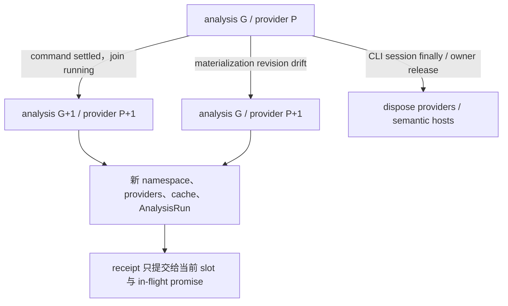

# Limina 生命周期与发布

[English](../limina-lifecycle.md) | [简体中文](./limina-lifecycle.md)

本页拥有 generation、cache、dispose、artifact mutation、migration 与 issue freshness 的完整解释。它们分别保护分析有效期、写入权限、发布完整性和结果新鲜度，不能合并成“所有状态都属于一个 generation”。

## Run、provider generation 与异步发布

[preflight manager](../../../packages/limina/src/preflight/manager.ts) 有 `#generation` 和 `#providerGeneration`。通常 command boundary 推进二者；materialization 因 base revision drift 触发 replan 时，只刷新 providers/namespace/cache，analysis task generation 保持不变。snapshot token 编入 root、两种 generation；数字本身不是物理文件版本。`ResolvedLiminaConfig.governanceRoot` 属于配置解析：最近 manifest 读取并验证一次，然后由根分类与根包构造共享。provider 刷新不产生第二份根 manifest fact，新的配置解析才建立新的根快照。该有界快照不冻结子包 manifest、整个文件系统或第三方工具的读取。

[executor](../../../packages/limina/src/execution/executor.ts) 是当前生产 generation controller 创建入口；[scheduler-loop](../../../packages/limina/src/execution/scheduler-loop.ts) 在 command settlement 标记推进后先 join running，再 startNextGeneration。manager 的 [materialization slot](../../../packages/limina/src/preflight/materialization.ts) 检查当前 slot 和 promise identity，防止旧异步结果覆盖新 receipt，失败后允许新尝试。命令可以改变 filesystem，因此不能只清一个查询结果继续复用旧 providers。

注入 custom providers 的 manager 只支持 generation zero；advance/replan 的检查发生在 dispose 和 replacement 之前，失败不会静默换成默认 providers。`dispose()` 幂等；但 manager 多数 `ensure*` 方法没有统一 disposed guard，不能宣称所有事后 API 调用都会被拒绝。生产调用方负责在 run 生命周期结束后不继续使用它；是否将该限制机械化是[审计风险](./limina-architecture-audit.md#findings)。

释放责任必须沿调用链定位：[CLI check-run](../../../packages/limina/src/cli/check-run.ts) 与 [standalone](../../../packages/limina/src/cli/standalone.ts) 在 `finally` dispose session；[graph export](../../../packages/limina/src/graph-check/runner.ts) 只 dispose 自建 preflight，borrowed preflight/custom providers 的生命周期归 caller。较低层 [pipeline execution](../../../packages/limina/src/pipeline/execution.ts) 可自建 preflight，但没有统一 finally dispose；直接重复调用该内部 API 的生命周期不应借用 CLI 的保证。domain aggregate 的 immutable 视图也不改变这些实际所有权。

## Cache identity 与能力范围

| Cache / context                                                            | Key / lifetime owner                                                                                                                                                                          | Invalidation 与限制                                                                                                                                                                                                                                                          |
| -------------------------------------------------------------------------- | --------------------------------------------------------------------------------------------------------------------------------------------------------------------------------------------- | ---------------------------------------------------------------------------------------------------------------------------------------------------------------------------------------------------------------------------------------------------------------------------- |
| Workspace、checker config、lookup、graph、route                            | [AnalysisProviderSet](../../../packages/limina/src/core/index.ts) 与 preflight promise/cache                                                                                                  | provider replacement 创建新集合；不能把一个 path-keyed map 作为全进程文件监控缓存                                                                                                                                                                                            |
| Region trie、canonical projection、exact classification、source config Set | [WorkspaceRegionPathIndex](../../../packages/limina/src/core/workspace/validated/path-index.ts) instance，由 workspace provider 的 getPathIndex Promise 共享                                  | provider-only replan 同样更换整个 index；不能只清 classification 而保留旧 trie/projection。[preflight regression](../../../packages/limina/src/__tests__/preflight.spec.ts) 在 analysis generation 不变时重绑 alias 并新增 boundary                                          |
| Project dependency collection / preparation                                | [cache](../../../packages/limina/src/core/project-dependencies/cache.ts)：adapter、family、config/options/raw refs/roots、generation、package/resolver/framework identity、workspace boundary | final collection 再含 workspace export policy identity；有 callback 却无 identity 时禁用 final cache；返回 clones 防调用方污染缓存                                                                                                                                           |
| Native facts snapshot                                                      | [identity](../../../packages/limina/src/core/typescript-semantic/identity.ts)：config/options/roots/raw refs/admission boundary 等                                                            | full context 结束前复制完整 resolution/admission/evidence/requirement facts；不得用 roots-only snapshot 的 hasSourceFile() 重算 admission；key 没有 source content digest，正确性依赖 provider 生命周期。边界会影响 ambient evidence，绝非 boundary-independent syntax cache |
| Native live context                                                        | [context](../../../packages/limina/src/core/typescript-semantic/context.ts) 持有 Program、ledger、resolver、maps                                                                              | 方法在 dispose 后拒绝操作；snapshot 保存历史 facts。公开的 readonly Program 字段并不等于对象物理销毁或全对象不可访问                                                                                                                                                         |
| Vue                                                                        | [manager](../../../packages/limina/src/core/vue-semantic/context-manager.ts) 与 process-wide active context slot                                                                              | 同 identity 可共享 owners；切到不同 identity 会替换并 dispose 旧 slot；last owner release 回收。不是每个 provider 独占一份长期 Vue Program                                                                                                                                   |
| Astro                                                                      | [context](../../../packages/limina/src/core/astro-semantic/context.ts) 按 project seed/toolchain 管理，Program lazy                                                                           | snapshot 结合当前 source text；manager dispose 回收 context。外部文件变化仍受整体 provider lifetime 限定                                                                                                                                                                     |
| Svelte                                                                     | [context](../../../packages/limina/src/core/svelte-semantic/context.ts) 单 active project，project identity 含 adapter/options/config closure/package/files/generation/profile                | leaf-owned toolchain；per-file sourceText 缓存与 managed lookup identity 分开；不是通用增量 watcher                                                                                                                                                                          |

native scope-evidence 缓存契约为 semantic context v4、native dependency facts v3、project dependency adapter v5、pending dependency adapter v4；pending clone 同时复制 referenceRequirement。native Core 路径复用既有 provider/query cache、以 Symbol 为键的 ambient cache 与 bounded Program；每次未缓存 project collection 创建一个 context，而非每个 occurrence 创建一个。`completeProject()` 释放 live handle，同时保留已复制 facts；dispose 后拒绝 live-context 操作。[Provider evidence tests](../../../packages/limina/src/__tests__/native-provider-evidence.spec.ts) 断言 Program 创建数、查询复用、snapshot 一致性与释放行为，不预设性能提升。

[FileOwnerLookup](../../../packages/limina/src/core/build-graph/file-owner-lookup.ts) 的 lexical/canonical 索引与 realpath cache 限于当前 analysis/provider 生命周期。新 provider generation 与 replan 从各自 membership 输入新建索引，缺失或已重绑路径不借用旧 generation 的 owner。它不是 filesystem watcher，也不保证跨任意原地文件编辑的缓存有效性。

**Derived**：当前缓存适合受控 run/provider 生命周期。若外部调用者跨文件编辑复用同一 cache/request generation，source content 不在 key 中就可能复用旧结果；这不是现有 CLI 必然 stale 的证据。要支持长期 daemon，必须先定义 mutation/version contract，不能简单扩大缓存寿命。

## Provider 拥有的原始语法复用

[SourceSyntaxFactsCache](../../../packages/limina/src/core/typescript-semantic/syntax-cache.ts) 属于一个 `AnalysisProviderSet`。项目依赖收集和原生 TypeEvidence 借用该实例；两个消费方都不负责释放它。Provider 更换（包括 analysis generation 不变的 provider-only replan）创建新缓存，provider dispose 清空条目。这里没有持久缓存或进程全局语法存储。

Bounded host 只在同步创建原生 Program 期间捕获 [OwnedSyntaxInput](../../../packages/limina/src/core/typescript-semantic/syntax-input.ts)。当前解析配方仅审阅覆盖 TypeScript **6.0.3**；其他编译器版本/实例、外来或框架 AST、解析错误、未知解析字段及作用域外调用使用原 collector。扩展配方必须提供对应的解析差分证据。描述符包含 lexical 文件名、编译器实例/版本、collector 版本、语言 target/variant、script kind、implied format、JSDoc 模式及原生 module-detection 策略。命中还要求完整文本相等；mtime 或 realpath 替换不能证明等价。

条目只保留文本和有序的 plain import records。存入与返回都复制 records，条目不含 AST、Program、Symbol、resolved target、admission、TypeEvidence 或 graph 结论。命中后仍初始化新 AST 的 parent pointers；每个 context 独立登记 triple-slash/lib admission 和 resolution。两个消费方保留现有 semantic identity 和 policy interpretation。这项优化不减少 Program 数量。

初始 LRU 预算为 96 MiB 的文本/字符串/对象存储**估算值**，单项上限为 8 MiB。超大条目绕过；每个描述符只保留最新文本。估算是保守记账，不是 heap/RSS 保证。缓存提供 hit/miss/bypass/eviction 与当前/峰值估算字节；原生 Program 构造和首次 TypeChecker 请求分别记录耗时。异步 phase wall 不是独占 CPU 时间。

可执行反例位于[缓存生命周期](../../../packages/limina/src/__tests__/source-syntax-cache.spec.ts)、[语法差分](../../../packages/limina/src/__tests__/source-syntax-differential.spec.ts)和 [provider replan](../../../packages/limina/src/__tests__/preflight.spec.ts)。覆盖内容变化、调用方修改、lexical alias、错误/外来输入、淘汰、dispose、同 generation 更换、70 个合成源码和 432 组外来解析配方。完整性能结论需要冻结 workload 的对照；这些测试通过本身不证明提速。

## Source 阶段观测

[Source phases](../../../packages/limina/src/source-check/phases.ts) 分离只读准备、Knip 执行/清理和只读 ownership/authority/reporting。Runner 在**现有整体 task 资源声明**下顺序执行。公开 task 仍是 `source:check`，最终 source 结果只发布一次。Knip 失败或清理错误仍阻止后续阶段发布成功。Phase wall 观测不授权其他读取方在 Knip 临时入口可见时并发扫描，也不削弱 manifest、repository、generated-file 或跨进程 lease 约束。

## Namespace、物理身份与 plan

[namespace-core](../../../packages/limina/src/domain/artifacts/namespace-core.ts) 记录 logical root、canonical root、generation token，并通过内部 WeakSet 认证；[artifact plan](../../../packages/limina/src/domain/artifacts/plan.ts) 也认证并关联同一个 token。相同 root 与 numeric generation 的两个新 namespace 不能互换 plan。生产 graph 生成 revisioned plan；内部 unrevisioned plan 构造入口存在，不能把 base-revision 检查泛化到每个 API 输入。

Generated config 身份相对 active workspace root 判定；更高目录里的 `.limina` 名称不应误伤嵌套 workspace 的 source config。[mutation authority](../../../packages/limina/src/utils/mutation/authority-create.ts) 对可信 base 取 canonical identity，检查 logical chain、scope 和 containment；输出定位不自动赋予 mutation 权限。

[identity checks](../../../packages/limina/src/utils/mutation/identity.ts) 使用 lstat/open/fstat、content/hash、device/inode、link/metadata 等组合验证 binding。逻辑 symlink/junction、物理 escape、binding drift 分别有拒绝路径。它们是具体执行 guard，不是对任何操作系统并发攻击都绝对无竞态的证明。

## Generated artifacts 的发布与恢复

生成的声明目录与增量缓存路径在既有 checker 和目录分区内保留完整源配置文件名，包括 `tsconfig.` 和 `.json`，因此 `tsconfig.json` 与 `tsconfig.tsconfig.json` 不再共享路径。规划阶段拒绝不同源配置占用同一路径。重新生成会更新受管配置；过期清理只依据原有所有权清单，不递归删除未登记的编译缓存或用户文件。[Namespace 守卫](../../../packages/limina/src/__tests__/artifact-namespace.spec.ts)与[图重新生成测试](../../../packages/limina/src/__tests__/generated-graph.spec.ts)覆盖路径冲突、旧所有权清单和重复规划。

[materializer](../../../packages/limina/src/core/build-graph/materializer.ts) 的生产路径：

1. 认证 namespace/plan；获得 canonical root 的跨进程 writer lease。
2. 在 lease 内读取 base revision。drift 时最多完整 replan 一次，要求仍是同一 canonical lease root。
3. 写入 in-progress marker，包含 base/desired revision 与 owned-path universe。
4. 写目标文件，删除不再属于目标的旧 owned paths；manifest 最后写。
5. 验证 desired tree 后删除 marker，才完成 receipt。

失败后 marker 保留，reader lease 报 recovery required；下一个 writer 用完整新 plan 恢复并验证后解除 marker。manifest-last 是协议的一环，不是 filesystem 多文件原子事务。恢复没有通用 journal 或 backup tree。Checker typecheck 在可能的重新规划完成后，从物化 receipt 选择目标，包括判断是否没有目标；其[读租约](../../../packages/limina/src/core/build-graph/materialization-read-lease.ts)在启动 checker 前检查当前产物 revision 仍匹配 receipt，漂移时明确失败并要求重新执行命令。Checker build、选定 checker build 和 managed output build 在编译器执行前使用同一 receipt/revision 握手。单独的 reader lease 不能授权旧的内存 classification 消费更新的 generated closure；其他无关产物消费者仍遵循各自协议。[回归覆盖](../../../packages/limina/src/__tests__/typecheck.spec.ts)在规划与物化之间改变 leaf 和 package root，并在取得读租约前替换 receipt。

[manifest version](../../../packages/limina/src/core/build-graph/manifest-version.ts) / [ownership](../../../packages/limina/src/core/build-graph/manifest-ownership.ts) 允许旧格式仅作为 cleanup ownership ledger；当前 schema 定义在生产 types。当前检查时为 v5，v1–4 不作为当前 graph 重用。future/非法版本拒绝。ordering 使用 code-unit comparison；运行时能力描述和 live source descriptors 不因此变成持久化 graph。

这套 namespace materialization 管的是 managed generated artifacts。graph export 的用户目标文件、`build --raw` 的外部工具输出和 migration 有不同 writer contract；不能写成“全部磁盘写入都经过 materializer”。managed checker output 另经 [managed-mutation](../../../packages/limina/src/typecheck/managed-mutation.ts) 与 [output](../../../packages/limina/src/typecheck/output/) 校验 authority。

跨进程 holder 通过目录 rename 发布不可变、以 token 命名的 owner record。回收只删除观察到的 record，然后执行非递归 rmdir；替换 holder 的不同 record 会阻止其非空目录被删除。release 使用相同规则。清理中断留下的空已发布 slot 可以恢复；未发布的 reader candidate 不属于 reader membership，不能作为空 lease 被回收。旧 `owner.json` record 可以退役，但不再发布这种格式。这是当前 Limina 进程之间的协作协议；并发运行且递归删除 holder 的旧版二进制不在该协议内。[Lease 回收守卫](../../../packages/limina/src/__tests__/cross-process-lease-reclamation.spec.ts)在另一 writer 获得 slot 时分别延迟 record 删除与目录移除。

Holder 发布的 rename 返回 `EEXIST` 或 `ENOTEMPTY` 时已经证明发生争用；即使该 holder 在后续检查前释放，也应重试。要求它继续存在会把正常释放变成致命持久化错误，包括 check-index 发布期间。存在歧义的 Windows 风格 `EACCES`、`EBUSY`、`EPERM` 仍须以 holder 仍存在为依据；无关 I/O 错误必须继续传播。重试回到现有的有界获取协议，不绕过 owner 验证、失效 owner 回收或 latest-attempt 检查。[发布守卫](../../../packages/limina/src/__tests__/cross-process-lease-holder.spec.ts) 覆盖真实 POSIX 冲突后释放、两种明确冲突错误码对应 holder 已不存在，以及权限与其他错误对照。[并发 CLI 回归](../../../packages/limina/src/__tests__/cli.spec.ts) 拒绝持久化警告，并在查询失败时包含 stdout/stderr。这维护 I11 的发布完整性与 I12 的新鲜度；仅凭 CI 查询退出码无法确定发生了哪一种持久化失败。

独占 declaration publication 在写入、同步和回读前捕获新空文件的 identity。失败时保留该 identity 供回滚；未完成内容必须仍为预期字节的前缀，且 device/inode/mode/link count 相同。已验证文件保留完整 content-hash 检查。每个 parent directory 在创建下一级前单独加入事务 ledger，后续失败不能丢失此前的清理 ownership。无法读取 identity 或外部替换不会授予删除 authority。[Publication 失败守卫](../../../packages/limina/src/__tests__/output-publication-failures.spec.ts)注入 partial write、sync/readback 失败、目录失败和替换，并检查重试与用户文件保留。

## Migration 是另一种事务

[migration command](../../../packages/limina/src/commands/migration/) 先根据 TypeScript effective config 与 JSONC parser 形成精确编辑计划。它遍历 reachable source closure，聚合不支持的 named solution，再查询全部涉及的 Git worktrees。dirty worktree 需要一次明确交互决定，拒绝/取消/无法交互在 filesystem transaction 前停止；批准只适用于该计划，没有授予改其他文件的权限。

输出迁移保护 effective `declarationDir`/`outFile` 等约束：只有与计划单 output root 等价的直接 declarationDir 才能移除或迁入 `liminaOptions.outputs.outDir`；继承声明不改写 base；分裂输出等无效配置拒绝。局部 JSONC edit 保留无关 comments、trailing commas 与文本。规划在任何事务开始前拒绝迁移字段及其祖先容器的重复键，并重新解析每个候选文本，将其有效对象与对象计划比较。任何失败都会取消整批迁移。[JSONC 守卫](../../../packages/limina/src/commands/migration/jsonc-validation.ts)与[批量回归测试](../../../packages/limina/src/__tests__/migration.spec.ts)区分写入前拒绝与回滚；不使受管路径产生歧义的无关重复字段会保留。

[transaction execution](../../../packages/limina/src/commands/migration/transaction/execution.ts) 与 preflight 只处理真正修改的目标，保存 physical identity、content 和 metadata，拒绝非 regular、不可写、symlink/junction、越界和重复物理目标。single-link 使用 atomic replacement；multi-link 要求 rewrite in place / skip / cancel 决定。in-place 保留 hardlink topology，完整 positional writes + truncation，明确非原子。

atomic commits 先于 in-place commits；rollback 按真实 mutation 顺序逆序。in-place 失败或 post-write drift 使当前内容不确定时，保留现场与 immutable backup，不盲目覆盖。migration 没有跨进程 writer lease；不要把 materializer 的排他性移植为它的事实。交互默认和 private artifact mode 属于 supporting implementation，改动时检查 [migration tests](../../../packages/limina/src/__tests__/) 中的实际 prompt/transaction cases。

POSIX checker 执行会持续跟踪所属进程组直到终止，包括组长已经退出的情况。组长自然退出时，即使未取消也会启动后代清理；清理成功后保留组长原始退出状态。组长的 close 事件不再取消强制终止计时。runner 在报告完成前等待进行中的进程组清理；checker host 保留该组直到清理结束，host 关闭时也一样。清理超时有明确上限，并报告为失败的执行结果。[进程组测试](../../../packages/limina/src/__tests__/process-tree.spec.ts)使用响应／忽略信号的子进程、已经退出的组长及直接／host 执行。这些测试不证明 Windows taskkill 的后代终止行为。

## Issue identity 与 freshness

命令帮助是已经完成的 CLI 结果。CAC 打印帮助后会清除 matched command，因此 CLI 在渲染帮助时记录匹配状态，再应用未知命令守卫。全局与嵌套帮助不加载配置、不创建治理产物；未知命令仍失败，包括同时请求帮助的情况。[CLI 测试](../../../packages/limina/src/__tests__/cli.spec.ts)覆盖真实进程及这些副作用对照。

inline 终端写入跟踪转发 chunk 时保留原 Writable 接收者，结束后恢复同一个原始方法。stdout 和 stderr 共用一个流时只包装一次。Buffer/string 编码、callback 和回压仍由流本身负责。[真实 Writable 测试](../../../packages/limina/src/__tests__/terminal-frame.spec.ts)覆盖两种 write 重载及完整 inline reporter。正常的子进程 renderer 与仅状态 reporter 是不同路径；该修复保护子进程 renderer 不可用时的 inline fallback。

Finding producer 保留 typed semantic facts，issue projector 按域组成稳定 identity、去重与排序；同一位置的不同 semantic finding 不能因展示字段相同而吞掉。[check-reporting](../../../packages/limina/src/check-reporting/) 定义 canonical issue inventory；terminal presentation 不决定事实 identity。

[check-attempt-io](../../../packages/limina/src/source-check/snapshot/check-attempt-io.ts) 发布 sequence、attempt identity 与 started metadata，完成时提交 `last-run.json` 与认证它的 latest-completed metadata/digest。较旧 completion 不能压过较新 sequence。当前 [snapshot types](../../../packages/limina/src/source-check/snapshot/types.ts) 是 check v8、source v1；standalone [invocation snapshot](../../../packages/limina/src/check-reporting/invocation-snapshot.ts) 是另一个 v1 schema，使用独立 invocation ID。三个版本不能混写。读取器和写入器的拒绝消息从 `CHECK_ISSUE_SNAPSHOT_VERSION` 获取支持的 check 版本；旧版和未来版 check wire model 仍被拒绝。[快照测试](../../../packages/limina/src/__tests__/source-snapshot.spec.ts)与[完成 attempt 测试](../../../packages/limina/src/__tests__/check-attempt.spec.ts)覆盖无效写入、版本拒绝，以及 metadata 一致但快照使用旧版本的情况。

`check --issues` 查询 persisted state，不运行新检查。它的 `QueryConfigAnchor` 与 `ExecutionConfigLocation` 不同：显式路径相对 cwd 做 lexical 解析，可以不存在。locator 从其 dirname 寻找最近 manifest，验证对象，不分类 membership、不 import 配置、不执行配置函数、不构建 preflight。未指定路径时发现当前存在的默认配置，缺少记录不重定向到祖先 workspace。生成的 invocation 命令绑定绝对配置、Node 路径和已安装 Limina binary；[回放测试](../../../packages/limina/src/__tests__/single-package-cli.spec.ts) 删除配置并检查持久化状态不变、配置没有额外执行。latest running/interrupted/aborted/persistence-failed/corrupt metadata 或不一致 completion pair 禁止 fallback 到旧 inventory；corrupt latest attempt 还阻止新 sequence 分配。显式 standalone invocation query 有自己的输入校验，不等于 latest full check。

完成状态、失败状态、未运行与 inventory 不可用需要分开输出；机器 JSON/NDJSON 和人类文本可不同展示，但不能把不可用输出为本轮零问题。`LIMINA_PROFILE=1` 的性能观测也不改变 issue authority；profile/snapshot 的 atomic writer 不等于整个 check 的跨文件原子性。

自定义条件 DAG 摘要保留既有诊断身份的集合，每个身份在阶段上下文中只有一个 finding 对象。共享路径合并身份，不再按每条引用路径复制诊断数组；默认域与命名域共享已发布身份集合，并在各自阶段内按稳定的身份顺序发布 finding。项目路径可达性以及预期/实际条件信息保持完整。诊断存储槽位的上界因此是项目数乘不同 mismatch 数，而不是路径数；这不代表总内存线性，因为可达性集合仍是传递集合。[对抗性 DAG 测试](../../../packages/limina/src/__tests__/condition-subtree.spec.ts) 对照直接边 oracle、逆序项目遍历、深/宽菱形、条件一致及重叠域。
