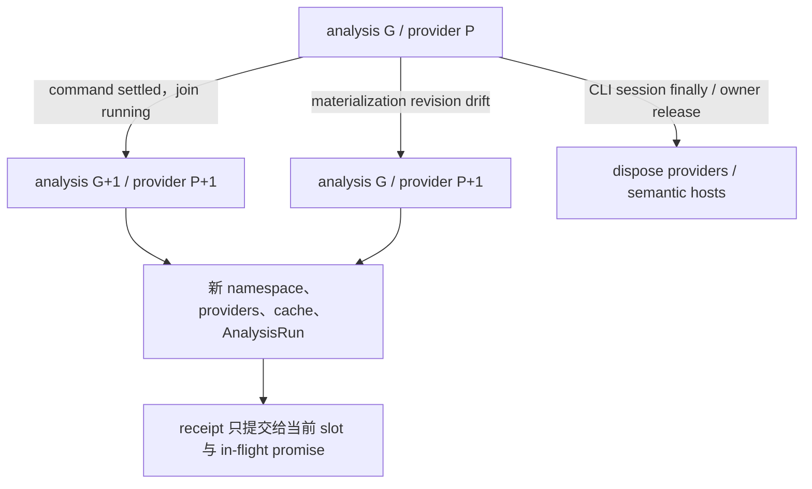

# Limina 生命周期与发布

[English](../limina-lifecycle.md) | [简体中文](./limina-lifecycle.md)

本页拥有 generation、cache、dispose、artifact mutation、migration 与 issue freshness 的完整解释。它们分别保护分析有效期、写入权限、发布完整性和结果新鲜度，不能合并成“所有状态都属于一个 generation”。

## Run、provider generation 与异步发布

[preflight manager](../../../packages/limina/src/preflight/manager.ts) 有 `#generation` 和 `#providerGeneration`。通常 command boundary 推进二者；materialization 因 base revision drift 触发 replan 时，只刷新 providers/namespace/cache，analysis task generation 保持不变。snapshot token 编入 root、两种 generation；数字本身不是物理文件版本。

[executor](../../../packages/limina/src/execution/executor.ts) 是当前生产 generation controller 创建入口；[scheduler-loop](../../../packages/limina/src/execution/scheduler-loop.ts) 在 command settlement 标记推进后先 join running，再 startNextGeneration。manager 的 [materialization slot](../../../packages/limina/src/preflight/materialization.ts) 检查当前 slot 和 promise identity，防止旧异步结果覆盖新 receipt，失败后允许新尝试。命令可以改变 filesystem，因此不能只清一个查询结果继续复用旧 providers。

注入 custom providers 的 manager 只支持 generation zero；advance/replan 的检查发生在 dispose 和 replacement 之前，失败不会静默换成默认 providers。`dispose()` 幂等；但 manager 多数 `ensure*` 方法没有统一 disposed guard，不能宣称所有事后 API 调用都会被拒绝。生产调用方负责在 run 生命周期结束后不继续使用它；是否将该限制机械化是[审计风险](./limina-architecture-audit.md#findings)。

释放责任必须沿调用链定位：[CLI check-run](../../../packages/limina/src/cli/check-run.ts) 与 [standalone](../../../packages/limina/src/cli/standalone.ts) 在 `finally` dispose session；[graph export](../../../packages/limina/src/graph-check/runner.ts) 只 dispose 自建 preflight，borrowed preflight/custom providers 的生命周期归 caller。较低层 [pipeline execution](../../../packages/limina/src/pipeline/execution.ts) 可自建 preflight，但没有统一 finally dispose；直接重复调用该内部 API 的生命周期不应借用 CLI 的保证。domain aggregate 的 immutable 视图也不改变这些实际所有权。

## Cache identity 与能力范围

| Cache / context                                                            | Key / lifetime owner                                                                                                                                                                          | Invalidation 与限制                                                                                                                                                                                                                 |
| -------------------------------------------------------------------------- | --------------------------------------------------------------------------------------------------------------------------------------------------------------------------------------------- | ----------------------------------------------------------------------------------------------------------------------------------------------------------------------------------------------------------------------------------- |
| Workspace、checker config、lookup、graph、route                            | [AnalysisProviderSet](../../../packages/limina/src/core/index.ts) 与 preflight promise/cache                                                                                                  | provider replacement 创建新集合；不能把一个 path-keyed map 作为全进程文件监控缓存                                                                                                                                                   |
| Region trie、canonical projection、exact classification、source config Set | [WorkspaceRegionPathIndex](../../../packages/limina/src/core/workspace/validated/path-index.ts) instance，由 workspace provider 的 getPathIndex Promise 共享                                  | provider-only replan 同样更换整个 index；不能只清 classification 而保留旧 trie/projection。[preflight regression](../../../packages/limina/src/__tests__/preflight.spec.ts) 在 analysis generation 不变时重绑 alias 并新增 boundary |
| Project dependency collection / preparation                                | [cache](../../../packages/limina/src/core/project-dependencies/cache.ts)：adapter、family、config/options/raw refs/roots、generation、package/resolver/framework identity、workspace boundary | final collection 再含 workspace export policy identity；有 callback 却无 identity 时禁用 final cache；返回 clones 防调用方污染缓存                                                                                                  |
| Native facts snapshot                                                      | [identity](../../../packages/limina/src/core/typescript-semantic/identity.ts)：config/options/roots/raw refs/admission boundary 等                                                            | full context 结束前复制 facts；key 没有 source content digest，正确性依赖 provider 生命周期。边界会影响 ambient evidence，绝非 boundary-independent syntax cache                                                                    |
| Native live context                                                        | [context](../../../packages/limina/src/core/typescript-semantic/context.ts) 持有 Program、ledger、resolver、maps                                                                              | 方法在 dispose 后拒绝操作；snapshot 保存历史 facts。公开的 readonly Program 字段并不等于对象物理销毁或全对象不可访问                                                                                                                |
| Vue                                                                        | [manager](../../../packages/limina/src/core/vue-semantic/context-manager.ts) 与 process-wide active context slot                                                                              | 同 identity 可共享 owners；切到不同 identity 会替换并 dispose 旧 slot；last owner release 回收。不是每个 provider 独占一份长期 Vue Program                                                                                          |
| Astro                                                                      | [context](../../../packages/limina/src/core/astro-semantic/context.ts) 按 project seed/toolchain 管理，Program lazy                                                                           | snapshot 结合当前 source text；manager dispose 回收 context。外部文件变化仍受整体 provider lifetime 限定                                                                                                                            |
| Svelte                                                                     | [context](../../../packages/limina/src/core/svelte-semantic/context.ts) 单 active project，project identity 含 adapter/options/config closure/package/files/generation/profile                | leaf-owned toolchain；per-file sourceText 缓存与 managed lookup identity 分开；不是通用增量 watcher                                                                                                                                 |

**Derived**：当前缓存适合受控 run/provider 生命周期。若外部调用者跨文件编辑复用同一 cache/request generation，source content 不在 key 中就可能复用旧结果；这不是现有 CLI 必然 stale 的证据。要支持长期 daemon，必须先定义 mutation/version contract，不能简单扩大缓存寿命。

## Namespace、物理身份与 plan

[namespace-core](../../../packages/limina/src/domain/artifacts/namespace-core.ts) 记录 logical root、canonical root、generation token，并通过内部 WeakSet 认证；[artifact plan](../../../packages/limina/src/domain/artifacts/plan.ts) 也认证并关联同一个 token。相同 root 与 numeric generation 的两个新 namespace 不能互换 plan。生产 graph 生成 revisioned plan；内部 unrevisioned plan 构造入口存在，不能把 base-revision 检查泛化到每个 API 输入。

Generated config 身份相对 active workspace root 判定；更高目录里的 `.limina` 名称不应误伤嵌套 workspace 的 source config。[mutation authority](../../../packages/limina/src/utils/mutation/authority-create.ts) 对可信 base 取 canonical identity，检查 logical chain、scope 和 containment；输出定位不自动赋予 mutation 权限。

[identity checks](../../../packages/limina/src/utils/mutation/identity.ts) 使用 lstat/open/fstat、content/hash、device/inode、link/metadata 等组合验证 binding。逻辑 symlink/junction、物理 escape、binding drift 分别有拒绝路径。它们是具体执行 guard，不是对任何操作系统并发攻击都绝对无竞态的证明。

## Generated artifacts 的发布与恢复

[materializer](../../../packages/limina/src/core/build-graph/materializer.ts) 的生产路径：

1. 认证 namespace/plan；获得 canonical root 的跨进程 writer lease。
2. 在 lease 内读取 base revision。drift 时最多完整 replan 一次，要求仍是同一 canonical lease root。
3. 写入 in-progress marker，包含 base/desired revision 与 owned-path universe。
4. 写目标文件，删除不再属于目标的旧 owned paths；manifest 最后写。
5. 验证 desired tree 后删除 marker，才完成 receipt。

失败后 marker 保留，reader lease 报 recovery required；下一个 writer 用完整新 plan 恢复并验证后解除 marker。manifest-last 是协议的一环，不是 filesystem 多文件原子事务。恢复没有通用 journal、backup tree 或 consumer-side 第二次 revision handshake。

[manifest version](../../../packages/limina/src/core/build-graph/manifest-version.ts) / [ownership](../../../packages/limina/src/core/build-graph/manifest-ownership.ts) 允许旧格式仅作为 cleanup ownership ledger；当前 schema 定义在生产 types。当前检查时为 v5，v1–4 不作为当前 graph 重用。future/非法版本拒绝。ordering 使用 code-unit comparison；运行时能力描述和 live source descriptors 不因此变成持久化 graph。

这套 namespace materialization 管的是 managed generated artifacts。graph export 的用户目标文件、`build --raw` 的外部工具输出和 migration 有不同 writer contract；不能写成“全部磁盘写入都经过 materializer”。managed checker output 另经 [managed-mutation](../../../packages/limina/src/typecheck/managed-mutation.ts) 与 [output](../../../packages/limina/src/typecheck/output/) 校验 authority。

## Migration 是另一种事务

[migration command](../../../packages/limina/src/commands/migration/) 先根据 TypeScript effective config 与 JSONC parser 形成精确编辑计划。它遍历 reachable source closure，聚合不支持的 named solution，再查询全部涉及的 Git worktrees。dirty worktree 需要一次明确交互决定，拒绝/取消/无法交互在 filesystem transaction 前停止；批准只适用于该计划，没有授予改其他文件的权限。

输出迁移保护 effective `declarationDir`/`outFile` 等约束：只有与计划单 output root 等价的直接 declarationDir 才能移除或迁入 `liminaOptions.outputs.outDir`；继承声明不改写 base；分裂输出等无效配置拒绝。局部 JSONC edit 保留无关 comments、trailing commas 与文本。

[transaction execution](../../../packages/limina/src/commands/migration/transaction/execution.ts) 与 preflight 只处理真正修改的目标，保存 physical identity、content 和 metadata，拒绝非 regular、不可写、symlink/junction、越界和重复物理目标。single-link 使用 atomic replacement；multi-link 要求 rewrite in place / skip / cancel 决定。in-place 保留 hardlink topology，完整 positional writes + truncation，明确非原子。

atomic commits 先于 in-place commits；rollback 按真实 mutation 顺序逆序。in-place 失败或 post-write drift 使当前内容不确定时，保留现场与 immutable backup，不盲目覆盖。migration 没有跨进程 writer lease；不要把 materializer 的排他性移植为它的事实。交互默认和 private artifact mode 属于 supporting implementation，改动时检查 [migration tests](../../../packages/limina/src/__tests__/) 中的实际 prompt/transaction cases。

## Issue identity 与 freshness

Finding producer 保留 typed semantic facts，issue projector 按域组成稳定 identity、去重与排序；同一位置的不同 semantic finding 不能因展示字段相同而吞掉。[check-reporting](../../../packages/limina/src/check-reporting/) 定义 canonical issue inventory；terminal presentation 不决定事实 identity。

[check-attempt-io](../../../packages/limina/src/source-check/snapshot/check-attempt-io.ts) 发布 sequence、attempt identity 与 started metadata，完成时提交 `last-run.json` 与认证它的 latest-completed metadata/digest。较旧 completion 不能压过较新 sequence。当前 [snapshot types](../../../packages/limina/src/source-check/snapshot/types.ts) 是 check v8、source v1；standalone [invocation snapshot](../../../packages/limina/src/check-reporting/invocation-snapshot.ts) 是另一个 v1 schema，使用独立 invocation ID。三个版本不能混写。

`check --issues` 查询 persisted state，不运行新检查。latest running/interrupted/aborted/persistence-failed/corrupt metadata 或不一致 completion pair 禁止 fallback 到旧 inventory；corrupt latest attempt 还阻止新 sequence 分配。显式 standalone invocation query 有自己的输入校验，不等于 latest full check。

完成状态、失败状态、未运行与 inventory 不可用需要分开输出；机器 JSON/NDJSON 和人类文本可不同展示，但不能把不可用输出为本轮零问题。`LIMINA_PROFILE=1` 的性能观测也不改变 issue authority；profile/snapshot 的 atomic writer 不等于整个 check 的跨文件原子性。
