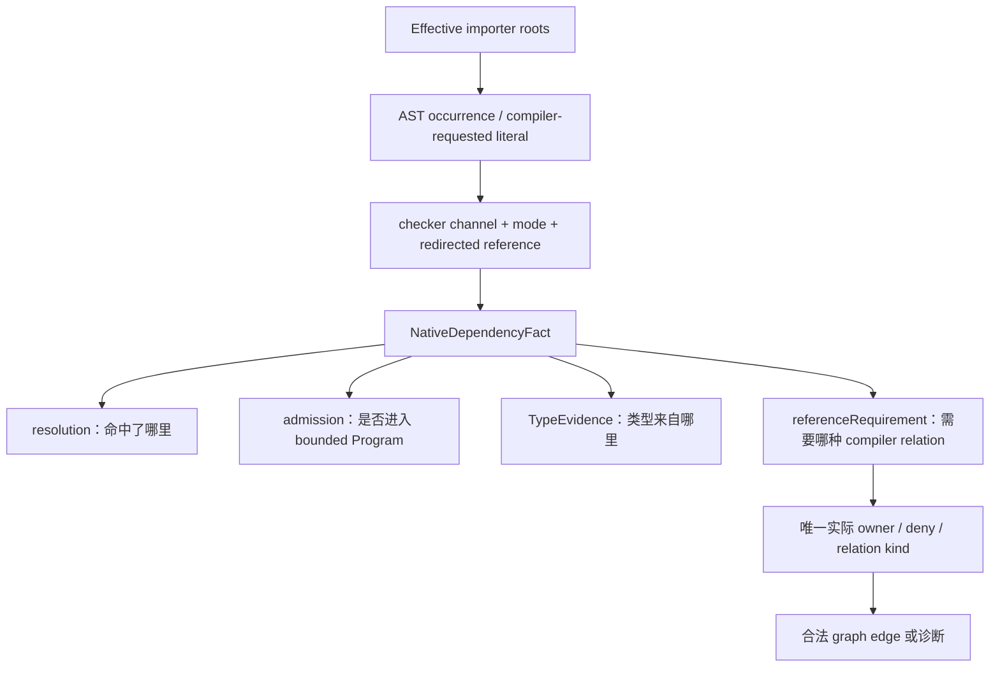

# Limina 语义事实

[English](../limina-semantics.md) | [简体中文](./limina-semantics.md)

本页解释 dependency fact 如何产生及其能力边界；实体和 relation 定义归[系统模型](./limina-system-model.md)，不可意外改变的性质归 [I02–I07](./limina-invariants.md)。本页描述当前 adapter 的行为，不宣称与所有上游版本的完整 checker 完全等价。

## 从 ownership 候选到 locked context

[checker-ownership-resolution](../../../packages/limina/src/core/build-graph/checker-ownership-resolution.ts) 先 discovery、root evidence、dependency facts 与 requirements convergence，再 freeze semantic authority，最后进行 Vue promotion、build coloring 与 finalization。[semantic-authority](../../../packages/limina/src/core/build-graph/checker-semantic-authority.ts) 只接受 explicit、config、root-file、dependency 作为语义锁证据；build-closure、fallback、solution-constraint、vue-promotion 不重写语义。

Pending discovery 使用 [pending-facts](../../../packages/limina/src/core/build-graph/checker-ownership-pending-facts.ts) 的 bounded native TypeScript context。framework inference 只接受合格的 `missing + pending-framework-candidate` fact。[physical candidate](../../../packages/limina/src/core/build-graph/checker-ownership-physical-candidate.ts) bootstrap 中，Oxc 提供物理候选，还需已知 framework extension、governed effective membership、唯一 config 和语义域，才形成 ownership requirement。普通 TS/resource 路径不凭物理命中锁框架。native source requirement 支持编译关系，不提供 framework semantic authority；物理 declaration resolution 即使 evidence 为 missing 也禁止 Oxc bootstrap。带 query 或 fragment 的 specifier（如 `./Widget.svelte?x`）同样不 bootstrap physical candidate：checker 没有给出 target 时，Limina 无权通过 Oxc 或文件系统重新解释宿主语法。canonical fallback 后，Vue custom profile 使用 owner 登记的路径匹配。

Locked [ProjectSemanticContext](../../../packages/limina/src/core/project-dependencies/contracts.ts) 在类型层要求 `LockedSemanticAuthority`。它与 pending discovery 是不同入口；构造函数复制 authority 不等于对任意 JavaScript 伪造对象做完整运行时认证。生产调用合法性来自求解流程和类型边界，不能把它写成不可绕过的安全 capability。

## 一个项目的原生语义输入

[effective-roots](../../../packages/limina/src/core/typescript-semantic/effective-roots.ts) 采用 checker parsed roots，并解析 effective `compilerOptions.types` 中相对入口，得到去重的 importer roots。声明文件可属于 roots。`ownedFileNames` 服务归属与 coverage；Program transitive files 为类型解释服务，均不能替代 importer 枚举。

[context](../../../packages/limina/src/core/typescript-semantic/context.ts) 默认构建 full bounded Program；[project-dependencies provider](../../../packages/limina/src/core/project-dependencies/provider.ts) 每次未缓存 collection 创建一个 context，处理所有 roots 后捕获 snapshot，在 `finally` dispose。它没有选择 `root-facts`，也没有为每个 occurrence 创建 Program。root-facts 是另一个更窄 admission mode，不能据此概括生产 locked provider。

[admission ledger](../../../packages/limina/src/core/typescript-semantic/admission.ts) 按原因纳入 effective roots、raw project references、显式 path/type references、libs、允许的 external module target 与 declaration closure。普通 workspace module target 可以被 resolver 找到而未进入 Program。外部 declaration importer 的相对声明闭包仍逐步经过 workspace source boundary；边界同时匹配 lexical 和 realpath identity，仅提供 Boolean membership，不携带 owner/provenance/policy。

raw references 来自用户 source/resolver config。生成 graph 推导出的 refs 不回流到这个输入，否则新增关系会改变生成它的证据，形成自证。`resolveJsonModule`、显式 roots、reference inputs、external library inputs 各自仍受 TypeScript 与 ledger 条件限制；不能概括成“所有非 roots 文件都被拒绝”。

## Occurrence、证据与建图需求

图中的四个 fact 字段并列，不能顺着箭头把路径、Program membership 和类型来源当作同义词。[import-resolver](../../../packages/limina/src/core/typescript-semantic/import-resolver.ts) 与 [module-records](../../../packages/limina/src/core/typescript-semantic/module-records.ts) 记录 occurrence 的 mode 和 redirected reference；triple-slash path、types、libs 走各自 compiler channel。JSX synthetic literal 只在 TypeScript 实际请求时记录，不能单凭 `jsx` 字段生成；相同配置下 preserve 也可能请求 JSX type runtime。

原生证据契约（2026-09-16 对照实现审查）由 [provider-evidence](../../../packages/limina/src/core/typescript-semantic/provider-evidence.ts) 和 [dependency-fact](../../../packages/limina/src/core/typescript-semantic/dependency-fact.ts) 实现。普通 module 与 JSX occurrence 先从 bounded checker 的 Symbol 识别 pure ambient declaration，再要求真实 SourceFile declaration 与当前 Program 的 provider 对象相同，包括 project-reference redirect。evidence kind 依据实际 provider 的 `isDeclarationFile`，evidence `filePath` 保存其真实路径。resolution、文件存在、后缀或 Program membership 单独都不能证明类型供给。已 admitted 但无 module Symbol 的 script 仍为 missing。JSON、CommonJS 与 augmentation 保持各自 compiler 行为，不统一要求 `isExternalModule()`。

显式 path/types/lib channel 通过合法 compiler input 与当前实际 SourceFile 证明输入，不要求 import Symbol；没有实际 compiler result 的 pragma 不制造 provider。admission 检查原始物理目标的 Program identity：source redirect 到输出 declaration 后，原 source 仍为 excluded。

| 解析与当前 scope                                                | admission               | TypeEvidence                                 | referenceRequirement                                   |
| --------------------------------------------------------------- | ----------------------- | -------------------------------------------- | ------------------------------------------------------ |
| 无物理目标，有 pure ambient                                     | unresolved              | ambient                                      | null                                                   |
| local/paths source，ambient 提供类型，membership 未覆盖         | 实际目标 membership     | ambient                                      | compiler-membership                                    |
| ambient 配 external-library source 或已覆盖 compiler input      | 可为 excluded           | ambient                                      | null                                                   |
| occurrence 在当前 Program 有实际 implementation provider        | 原目标 membership       | checker-source，记录实际 provider            | source-semantic                                        |
| source target 没有有效 provider                                 | excluded 或 admitted    | missing                                      | source-semantic                                        |
| raw project reference 将 source redirect 到已有输出 declaration | 原 source 可为 excluded | concrete-declaration，记录输出路径           | null；已有 reference 保留                              |
| raw reference 输出未生成                                        | excluded                | missing                                      | source-semantic 候选；已有关系去重并保留 compiler 错误 |
| 物理 declaration target                                         | 实际目标 membership     | 实际 concrete/ambient provider，否则 missing | null                                                   |
| 无 target、无 provider                                          | unresolved              | missing                                      | null                                                   |

物理 declaration 或实际 declaration provider 都停止新增 source relation。requirement 是候选义务，最终关系仍取决于 owner、deny、checker capability、declaration provider selection 与去重；同 owner 事实不制造自环。augmentation 仅在 occurrence 确有 implementation provider 时保持 checker-source；excluded augmentation 可为 missing 并携带 source requirement。

完整 module specifier 就是语义身份（2026-09-21 对照实现审查）。`./foo.ts`、`./foo.ts?raw`、`./foo.ts?x=1` 与 `./foo.ts#fragment` 是四个不同的请求。Limina 把每一个原样交给 checker：不剥离 query 或 fragment，不把它们的存在当作 resource 或 runtime evidence，也不因为 `./foo.ts` 物理存在就为带 query 的 occurrence 补出 resolution、admission 或 compiler relation。`import raw from './foo.ts?raw'` 配 `declare module '*?raw'` 得到 `resolution.target = null`、ambient TypeEvidence 与 null referenceRequirement；没有该声明时保持 missing 与 null requirement，不会被“修复”成 `./foo.ts`。`foo.ts` 通过 `files`/`include` 获得的 Program membership 是另一条事实，带 query 的 occurrence 既不创造也不消费它。如果某个 checker 确实解析了带 query 的请求（例如通过精确 `paths` key），Limina 照单接受，因为 query 本身没有任何 dependency 含义，只有 checker 的语义事实才有。Confirmed：这是当前实现，本版本不存在任何宿主 query 语义。Candidate：未来可能引入针对这类语法的显式 host authority，但当前代码与配置都没有提供该能力。

`ProjectDependency.targetKind` 通过 [declaration-classifier](../../../packages/limina/src/core/import-graph/declaration-classifier.ts) 独立分类物理 resolution，不从 TypeEvidence 推导，也不新增第二个持久化分类。TypeScript provider 与 Core native 分支通过既有 query/provider cache 共享 NativeDependencyFact，完整接受 ambient、missing 和 redirected declaration，不用路径重建证据。managed-output attribution 只装饰已证明的 declaration evidence，使用实际 provider 路径。framework PreparedDependencyFact 保持更严格的 source/target 验证契约。

[native-provider-evidence.spec.ts](../../../packages/limina/src/__tests__/native-provider-evidence.spec.ts) 检查 Program/Symbol identity、built/unbuilt reference、实际 provider 路径、diagnostics、缓存复用与释放；[native-reference-repair.spec.ts](../../../packages/limina/src/__tests__/native-reference-repair.spec.ts) 覆盖 ambient/augmentation 区分；[generated-graph.spec.ts](../../../packages/limina/src/__tests__/generated-graph.spec.ts) 将事实接到关系断言与真实 compiler build。[Resource module tests](../../../packages/limina/src/__tests__/resource-module-findings.spec.ts) 区分存在的 declaration companion 与 bounded 类型 provider。`resource` observation 携带 runtime classification，至多附带 checker-source TypeEvidence。没有 compiler relation 的 ambient 供给是 `semantic-only` observation：ambient module declaration 只证明 checker 能为该 specifier 提供类型，不证明存在物理 runtime resource。observation.kind 不能决定 TypeEvidence.kind。

普通 runtime-like import inspection 另有 TypeScript syntax pass 和 Oxc resolver 路径。这些 API 不共享 locked checker 的全部限制。带 query 或 fragment 的 specifier 不会交给 Oxc：它的 full-path 结果内建了 Limina 不采用的 bundler query 语义，因此除非 checker 提供框架源码目标，否则运行时解释保持 unsupported。即使把完整字符串传给文件系统路径归一化也不安全：`./absent.ts?x/../style.css` 会被折叠成 `./style.css`。因此 runtime inspection 与 missing-provider diagnostics 会在这类请求进入路径归一化之前停止；checker 实际产生的 source/declaration 结果和 compiler relation 仍然保留。原生 CommonJS 识别进行词法 binding 判断；shadowed `require` 排除，`createRequire(import.meta.url)` 只接受直接 immutable binding，mutable/indirect/computed 等形式不自动解释为 loader。证据见 [typescript-imports](../../../packages/limina/src/core/import-analysis/typescript-imports.ts) 及其测试。

Package resource resolution 保留 occurrence mode 与 custom conditions。null target、精确 package-import key 和 Node 拥有的 `module-sync` / `node-addons` conditions 使用只解析不加载的 Node probe；无法解析 package metadata 时也回退到该 probe。probe 继承进程中启用或禁用这些默认 conditions 的开关，不跨 Node 版本硬编码。其结果仅为物理 runtime evidence，不能成为 TypeEvidence 或 compiler relation。[Condition 守卫](../../../packages/limina/src/__tests__/resource-resolution-conditions.spec.ts)将 imports 和 exports 与当前运行 Node 的 resolver 对照。

## Locked resolution 与 framework preparation

[checker-resolution-provider](../../../packages/limina/src/core/import-analysis/checker-resolution-provider.ts) 的 locked routes 将 Oxc 设为 null。checker miss 保留 miss；runtime/resource 分类不能补一个 semantic target。此限制适用于该调用链，不能扩张成“Oxc 在 Limina 的所有分析中都不产生 evidence”。Astro pre-semantic eligibility 只跳过已知 virtual specifier、纯粹的显式非源码扩展名和 Oxc 识别出的 resource 目标；query 或 fragment 语法不是 skip authority，完整 specifier 会到达 Astro adapter，其结果照单接受。

[PreparedDependencyFact](../../../packages/limina/src/core/framework-semantic/contracts.ts) 保存 generated occurrence 到 source 的严格 provenance 和 checker evidence。[dependency-record](../../../packages/limina/src/core/project-dependencies/dependency-record.ts) 同时检查 target path 与 TypeEvidence kind；source / declaration kind 不匹配、无 target 却宣称 source/concrete evidence 都不可接入 graph。`resolvedBy` 是解析来源；TypeEvidence 是类型供给种类，两者必须分别记录。

| Family     | 实际语义通道                                                                                                                                                                           | 必须保留的限制                                                                                                                                                           |
| ---------- | -------------------------------------------------------------------------------------------------------------------------------------------------------------------------------------- | ------------------------------------------------------------------------------------------------------------------------------------------------------------------------ |
| TypeScript | full bounded Program 与原生 facts                                                                                                                                                      | provider collection 枚举 effective roots；外部环境 closure 可被加载但不自动成为 importer 集合                                                                            |
| Vue        | 由 Vue source profile 区分 native channel 与 Vue host/service script；[resolution](../../../packages/limina/src/core/vue-semantic/resolution.ts)                                       | 需要匹配的 VueSemanticIdentity；普通 native TS occurrence 不必都通过 SFC source map。strict mapping 失败不能任意挑另一段映射                                             |
| Astro      | [context](../../../packages/limina/src/core/astro-semantic/context.ts) 的 lazy language-service Program、Astro 类型环境和 generated snapshots；其他原生 channel 可走 TS                | root/config/toolchain 决定上下文；不能把能读取某邻接扩展等同于全部 framework checker 功能                                                                                |
| Svelte     | leaf-owned svelte2tsx / compiler / TS，TS host 解析 generated script；[module-resolution](../../../packages/limina/src/core/svelte-semantic/module-resolution.ts) 保留 occurrence mode | 显式 `.svelte` 解析不传 occurrence mode；虚拟 `.d.svelte.ts` 只在实际源存在且没有真实 `.svelte.d.ts` 时映回 source；真实 declaration 优先，无第二套 package exports 解析 |

Svelte adapter 的边界是 source transformation、generated host、严格 source mapping 和该 host 的 module resolution；它不加载完整 `svelte.config` / preprocess pipeline，不能据此承诺所有 svelte-check 配置同构。native `.ts/.js` 仍按 native roots/facts 枚举。生成图中 Astro/Svelte 是完整 leaf typecheck targets，不生成 declaration wrappers 或透明 build solutions。

Toolchain 来源、accepted versions 和 capability checks 以 [checker](../../../packages/limina/src/checker/) 中具体 resolver/runtime 与各 framework context 为准。source adapter 接受一个版本范围，只证明代码的 admission 条件；已安装 tuple 的测试只证明该 tuple 的样例。跨 minor、Windows、未安装 optional checker 仍需相应验证。

具体 tuple owner 是 [Vue compatibility](../../../packages/limina/src/checker/vue-semantic-compatibility.ts)、[Astro compatibility](../../../packages/limina/src/checker/astro-semantic-compatibility.ts) 和 [Svelte toolchain](../../../packages/limina/src/core/svelte-semantic/toolchain.ts)。Vue 从 vue-tsc 解析 Language Core/Volar/TypeScript；Astro 从 check-owned Language Server 解析 compiler，不能用 workspace-root retry 隐藏 leaf 缺依赖。路径用于 provenance/instance identity，不是 pnpm 布局兼容谓词。

Svelte [source-mapping](../../../packages/limina/src/core/svelte-semantic/source-mapping.ts) 要求 generated dependency 每个 UTF-16 offset 被明确 segments 连续、单调映射到当前 source；部分覆盖、cross-source 或非连续映射产生 mismatch，完全未映射保留 unmapped observation。[generated-script](../../../packages/limina/src/core/svelte-semantic/generated-script.ts) 构造 TraceMap 不加 map URL，避免 absolute Windows source drive 被再次 rebasing。Vue/Astro 则通过自身 mapping 算法处理 full-token/inner-content、ambiguity 与 mismatch，不能把一种框架的 map 条件套给全部框架。

Package framework-export preflight 在 package self-name location 使用明确的 SourceFile format，分别探测 import 和 require。实际 framework host 必须返回有类型的源码或 declaration；无关 JavaScript 分支不能遮蔽可用的有类型分支。此 index 记录 package capability，不是 occurrence TypeEvidence：实际消费者仍保留自身的 mode、provider 和 reference requirement。inactive condition 和 null target 仍被拒绝。[Vue export 守卫](../../../packages/limina/src/__tests__/vue-semantic.spec.ts)覆盖 NodeNext/Node16 import、require-only export、混合分支及 null target。

Vue 语义上下文中的原生文件使用同一套 Vue 所属 TypeScript 实例、语言服务 host 和编译选项计算模块格式。因此，懒加载的 SourceFile 对 .mts、.cts 和受包作用域影响的 .ts 文件选择与最终 Program 一致的 import/require 条件，无须仅为确定格式而构造 Program。[Vue 语义回归](../../../packages/limina/src/__tests__/vue-semantic.spec.ts) 将懒加载解析与实际 checker 的类型提供者比较，并断言 Program 仍保持懒加载。

默认原生 `tsc` 执行使用 Node 调用从 Limina 安装位置解析的 `typescript/bin/tsc`，与运行时依赖预检和原生语义分析保持同源。执行目录的 `.bin` 和环境 PATH 不能选择另一版 TypeScript。显式内部 runner 命令覆盖保留所请求的命令及参数契约。[命令来源测试](../../../packages/limina/src/__tests__/checker-command-origin.spec.ts)在没有 PATH 的情况下检查实际编译器版本，并保留 build/watch 与覆盖命令参数。

## 配置投影的边界

输出 target 的继承保留 TypeScript 数组顺序，即使同级分支共享祖先也一样。继承解析、环诊断和有效选项由 TypeScript 配置解析器负责。框架意图读取实际解析得到的配置闭包，包括包的 `tsconfig` 入口、带点文件名和无后缀文件；解析失败不能静默回退为默认 target。[Compiler target 回归测试](../../../packages/limina/src/__tests__/compiler-target.spec.ts) 将菱形、深层、重复、反向顺序和自身覆盖情形与 TypeScript parser 对照。

[compiler-overrides](../../../packages/limina/src/core/build-graph/compiler-overrides.ts) 与 [generated readers](../../../packages/limina/src/core/build-graph/generated/) 从 source effective config 投影 generated roots/options。相对 `types` 已纳入明确 roots 时，要删除会在 generated 目录重新解释的相对配置；`extends` 也必须使用 effective 值。声明和输出投影使用各自的生成配置路径应用相同的 roots/types 覆盖。显式 types 先由源项目所属 TypeScript 实例按原始选项（包括 typeRoots 和配置目录）枚举。这会在生成配置的回退根将普通 node_modules 包枚举为环境类型之前，固定 TypeScript 6 通配符展开结果。Vue 使用自己所属的编译器，因此不会静默升级旧编译器的通配符行为。命名条目可与通配符共存，随后移除已经纳入明确 roots 的相对条目。显式继承的 typeRoots 保持不变；自动发现的 typeRoots 相对于各自投影计算，而不是统一相对于声明配置。source checker authority 不能从 generated compiler options 倒推。

治理层的 source type leaf 不允许手写 `references`；[config reader](../../../packages/limina/src/core/build-graph/generated/config-reader-basics.ts) 拒绝该形状，solution 负责聚合，`implicitRefs` 记录明确动态/虚拟关系。底层 semantic context 支持 raw references，不等于治理层放宽 leaf shape。[generated-configs](../../../packages/limina/src/core/build-graph/generated-configs.ts) 将 declaration outDir/declarationDir 指向同一 managed dts root，防继承输出改写；`rewriteRelativeImportExtensions` 仅在 effective source 启用时覆盖，避免无条件引入旧 compiler 不认识的 option。支持的 solution 不带 outputs。

Concrete managed declaration 可以由 managed-output lookup 解释来源，但不会因此变成 source implementation。locked ownership 与 build coloring 只保留合格 requirement 或已确认的 pending candidate；保留的 source resolution 若 redirect 到 declaration，不能触发 Vue promotion。framework scheduling 只消费合格 source-semantic 关系，包括 missing source prerequisite；ambient compiler-membership 不进入 scheduling。修改这些入口时，同步检查 [I03–I07](./limina-invariants.md)，而不只看 resolver 单测是否仍命中同一路径。
