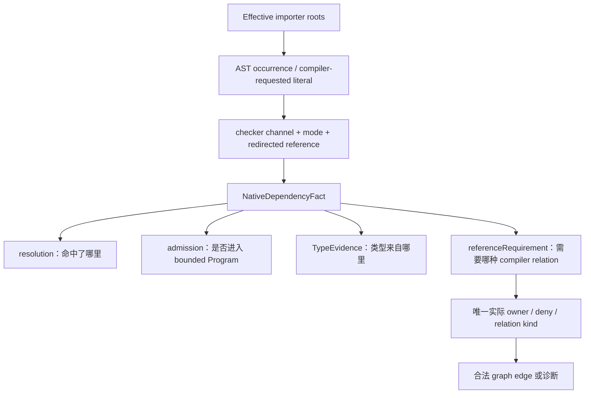

# Limina 语义事实

[English](../limina-semantics.md) | [简体中文](./limina-semantics.md)

本页解释 dependency fact 如何产生及其能力边界；实体和 relation 定义归[系统模型](./limina-system-model.md)，不可意外改变的性质归 [I02–I07](./limina-invariants.md)。本页描述当前 adapter 的行为，不宣称与所有上游版本的完整 checker 完全等价。

## 从 ownership 候选到 locked context

[checker-ownership-resolution](../../../packages/limina/src/core/build-graph/checker-ownership-resolution.ts) 先 discovery、root evidence、dependency facts 与 requirements convergence，再 freeze semantic authority，最后进行 Vue promotion、build coloring 与 finalization。[semantic-authority](../../../packages/limina/src/core/build-graph/checker-semantic-authority.ts) 只接受 explicit、config、root-file、dependency 作为语义锁证据；build-closure、fallback、solution-constraint、vue-promotion 不重写语义。

Pending discovery 使用 [pending-facts](../../../packages/limina/src/core/build-graph/checker-ownership-pending-facts.ts) 的 bounded native TypeScript context。只有 missing 路径能进入[physical candidate](../../../packages/limina/src/core/build-graph/checker-ownership-physical-candidate.ts) bootstrap：Oxc 提供物理候选，还需已知 framework extension、governed effective membership、唯一 config 和语义域，才形成 ownership requirement。普通 TS/resource 路径不凭物理命中锁框架。

Locked [ProjectSemanticContext](../../../packages/limina/src/core/project-dependencies/contracts.ts) 在类型层要求 `LockedSemanticAuthority`。它与 pending discovery 是不同入口；构造函数复制 authority 不等于对任意 JavaScript 伪造对象做完整运行时认证。生产调用合法性来自求解流程和类型边界，不能把它写成不可绕过的安全 capability。

## 一个项目的原生语义输入

[effective-roots](../../../packages/limina/src/core/typescript-semantic/effective-roots.ts) 采用 checker parsed roots，并解析 effective `compilerOptions.types` 中相对入口，得到去重的 importer roots。声明文件可属于 roots。`ownedFileNames` 服务归属与 coverage；Program transitive files 为类型解释服务，均不能替代 importer 枚举。

[context](../../../packages/limina/src/core/typescript-semantic/context.ts) 默认构建 full bounded Program；[project-dependencies provider](../../../packages/limina/src/core/project-dependencies/provider.ts) 每次未缓存 collection 创建一个 context，处理所有 roots 后捕获 snapshot，在 `finally` dispose。它没有选择 `root-facts`，也没有为每个 occurrence 创建 Program。root-facts 是另一个更窄 admission mode，不能据此概括生产 locked provider。

[admission ledger](../../../packages/limina/src/core/typescript-semantic/admission.ts) 按原因纳入 effective roots、raw project references、显式 path/type references、libs、允许的 external module target 与 declaration closure。普通 workspace module target 可以被 resolver 找到而未进入 Program。外部 declaration importer 的相对声明闭包仍逐步经过 workspace source boundary；边界同时匹配 lexical 和 realpath identity，仅提供 Boolean membership，不携带 owner/provenance/policy。

raw references 来自用户 source/resolver config。生成 graph 推导出的 refs 不回流到这个输入，否则新增关系会改变生成它的证据，形成自证。`resolveJsonModule`、显式 roots、reference inputs、external library inputs 各自仍受 TypeScript 与 ledger 条件限制；不能概括成“所有非 roots 文件都被拒绝”。

## Occurrence、证据与建图需求

图中的四个 fact 字段并列，不能顺着箭头把路径、Program membership 和类型来源当作同义词。[import-resolver](../../../packages/limina/src/core/typescript-semantic/import-resolver.ts) 与 [module-records](../../../packages/limina/src/core/typescript-semantic/module-records.ts) 记录 occurrence 的 mode 和 redirected reference；triple-slash path、types、libs 走各自 compiler channel。JSX synthetic literal 只在 TypeScript 实际请求时记录，不能单凭 `jsx` 字段生成；相同配置下 preserve 也可能请求 JSX type runtime。

[dependency-fact](../../../packages/limina/src/core/typescript-semantic/dependency-fact.ts) 的关键组合：

| 条件                                                                                     | TypeEvidence                                            | referenceRequirement                          | 解释                                                                   |
| ---------------------------------------------------------------------------------------- | ------------------------------------------------------- | --------------------------------------------- | ---------------------------------------------------------------------- |
| 命中 concrete declaration                                                                | concrete-declaration                                    | null                                          | 类型已经在 artifact 边界，不倒推源码 reference                         |
| checker 命中 source implementation                                                       | checker-source，或实际 symbol 为 ambient 时保留 ambient | source-semantic，或按下面 membership 条件决定 | target suffix 不能覆盖 checker symbol                                  |
| ambient symbol + 非 external implementation，且目标不在已有 compiler root/reference 输入 | ambient                                                 | compiler-membership                           | 类型由 ambient 提供，但 compiler 关系还缺 membership；二者同时为真     |
| ambient-only、目标已覆盖、或 external 情况                                               | ambient                                                 | null                                          | ambient provision 本身不制造 source edge                               |
| 模块 augmentation 关联 source-file symbol                                                | checker-source                                          | source-semantic                               | augmentation 不把真实 source module 降成 ambient-only                  |
| 无 target、无类型证据                                                                    | missing                                                 | null                                          | 后续可分类 observation / failure，不能凭 runtime resource 生成语义目标 |

[native-reference-repair.spec.ts](../../../packages/limina/src/__tests__/native-reference-repair.spec.ts) 覆盖这些区分；[generated-graph.spec.ts](../../../packages/limina/src/__tests__/generated-graph.spec.ts) 将事实接到实际声明图与 compiler differential 观察。`resource` observation 可以只有 runtime classification，也可以携带 ambient TypeEvidence；读取 observation.kind 不能推断 TypeEvidence.kind。

普通 runtime-like import inspection 另有 TypeScript syntax pass 和 Oxc resolver 路径。这些 API 不共享 locked checker 的全部限制。原生 CommonJS 识别进行词法 binding 判断；shadowed `require` 排除，`createRequire(import.meta.url)` 只接受直接 immutable binding，mutable/indirect/computed 等形式不自动解释为 loader。证据见 [typescript-imports](../../../packages/limina/src/core/import-analysis/typescript-imports.ts) 及其测试。

## Locked resolution 与 framework preparation

[checker-resolution-provider](../../../packages/limina/src/core/import-analysis/checker-resolution-provider.ts) 的 locked routes 将 Oxc 设为 null。checker miss 保留 miss；runtime/resource 分类不能补一个 semantic target。此限制适用于该调用链，不能扩张成“Oxc 在 Limina 的所有分析中都不产生 evidence”。

[PreparedDependencyFact](../../../packages/limina/src/core/framework-semantic/contracts.ts) 保存 generated occurrence 到 source 的严格 provenance 和 checker evidence。[dependency-record](../../../packages/limina/src/core/project-dependencies/dependency-record.ts) 同时检查 target path 与 TypeEvidence kind；source / declaration kind 不匹配、无 target 却宣称 source/concrete evidence 都不可接入 graph。`resolvedBy` 是解析来源；TypeEvidence 是类型供给种类，两者必须分别记录。

| Family     | 实际语义通道                                                                                                                                                                           | 必须保留的限制                                                                                                                                                           |
| ---------- | -------------------------------------------------------------------------------------------------------------------------------------------------------------------------------------- | ------------------------------------------------------------------------------------------------------------------------------------------------------------------------ |
| TypeScript | full bounded Program 与原生 facts                                                                                                                                                      | provider collection 枚举 effective roots；外部环境 closure 可被加载但不自动成为 importer 集合                                                                            |
| Vue        | 由 Vue source profile 区分 native channel 与 Vue host/service script；[resolution](../../../packages/limina/src/core/vue-semantic/resolution.ts)                                       | 需要匹配的 VueSemanticIdentity；普通 native TS occurrence 不必都通过 SFC source map。strict mapping 失败不能任意挑另一段映射                                             |
| Astro      | [context](../../../packages/limina/src/core/astro-semantic/context.ts) 的 lazy language-service Program、Astro 类型环境和 generated snapshots；其他原生 channel 可走 TS                | root/config/toolchain 决定上下文；不能把能读取某邻接扩展等同于全部 framework checker 功能                                                                                |
| Svelte     | leaf-owned svelte2tsx / compiler / TS，TS host 解析 generated script；[module-resolution](../../../packages/limina/src/core/svelte-semantic/module-resolution.ts) 保留 occurrence mode | 显式 `.svelte` 解析不传 occurrence mode；虚拟 `.d.svelte.ts` 只在实际源存在且没有真实 `.svelte.d.ts` 时映回 source；真实 declaration 优先，无第二套 package exports 解析 |

Svelte adapter 的边界是 source transformation、generated host、严格 source mapping 和该 host 的 module resolution；它不加载完整 `svelte.config` / preprocess pipeline，不能据此承诺所有 svelte-check 配置同构。native `.ts/.js` 仍按 native roots/facts 枚举。生成图中 Astro/Svelte 是完整 leaf typecheck targets，不生成 declaration wrappers 或透明 build solutions。

Toolchain 来源、accepted versions 和 capability checks 以 [checker](../../../packages/limina/src/checker/) 中具体 resolver/runtime 与各 framework context 为准。source adapter 接受一个版本范围，只证明代码的 admission 条件；已安装 tuple 的测试只证明该 tuple 的样例。跨 minor、Windows、未安装 optional checker 仍需相应验证。

具体 tuple owner 是 [Vue compatibility](../../../packages/limina/src/checker/vue-semantic-compatibility.ts)、[Astro compatibility](../../../packages/limina/src/checker/astro-semantic-compatibility.ts) 和 [Svelte toolchain](../../../packages/limina/src/core/svelte-semantic/toolchain.ts)。Vue 从 vue-tsc 解析 Language Core/Volar/TypeScript；Astro 从 check-owned Language Server 解析 compiler，不能用 workspace-root retry 隐藏 leaf 缺依赖。路径用于 provenance/instance identity，不是 pnpm 布局兼容谓词。

Svelte [source-mapping](../../../packages/limina/src/core/svelte-semantic/source-mapping.ts) 要求 generated dependency 每个 UTF-16 offset 被明确 segments 连续、单调映射到当前 source；部分覆盖、cross-source 或非连续映射产生 mismatch，完全未映射保留 unmapped observation。[generated-script](../../../packages/limina/src/core/svelte-semantic/generated-script.ts) 构造 TraceMap 不加 map URL，避免 absolute Windows source drive 被再次 rebasing。Vue/Astro 则通过自身 mapping 算法处理 full-token/inner-content、ambiguity 与 mismatch，不能把一种框架的 map 条件套给全部框架。

## 配置投影的边界

[compiler-overrides](../../../packages/limina/src/core/build-graph/compiler-overrides.ts) 与 [generated readers](../../../packages/limina/src/core/build-graph/generated/) 从 source effective config 投影 generated roots/options。相对 `types` 已纳入明确 roots 时，要删除会在 generated 目录重新解释的相对配置；`extends` 也必须使用 effective 值。source checker authority 不能从 generated compiler options 倒推。

治理层的 source type leaf 不允许手写 `references`；[config reader](../../../packages/limina/src/core/build-graph/generated/config-reader-basics.ts) 拒绝该形状，solution 负责聚合，`implicitRefs` 记录明确动态/虚拟关系。底层 semantic context 支持 raw references，不等于治理层放宽 leaf shape。[generated-configs](../../../packages/limina/src/core/build-graph/generated-configs.ts) 将 declaration outDir/declarationDir 指向同一 managed dts root，防继承输出改写；`rewriteRelativeImportExtensions` 仅在 effective source 启用时覆盖，避免无条件引入旧 compiler 不认识的 option。支持的 solution 不带 outputs。

Concrete managed declaration 可以由 managed-output lookup 解释来源，但不会因此变成 source implementation。build coloring 读取规范化 referenceRequirement；framework scheduling 只消费 source-semantic implementation relation。修改这些入口时，同步检查 [I03–I07](./limina-invariants.md)，而不只看 resolver 单测是否仍命中同一路径。
