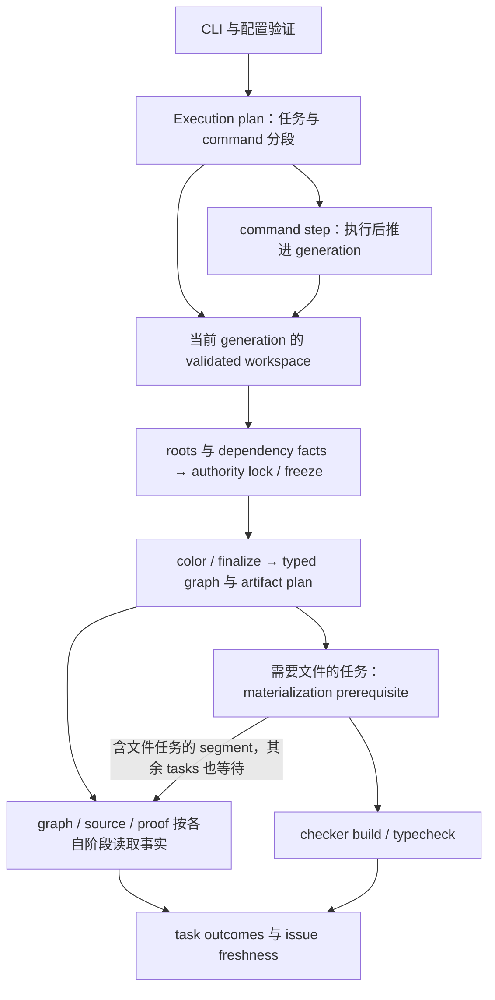

# Limina 系统模型

[English](../limina-system-model.md) | [简体中文](./limina-system-model.md)

本页拥有实体、authority、phase 和 relation 的定义。证据等级与维护规则见[入口](./limina.md)。本模型来自当前生产调用链；目录名称或一个未接入的抽象不构成运行证据。

## 系统边界与真实入口

`bin/limina.js` 在 source 存在时用 tsx 启动 CLI，否则启动构建后的 CLI；[factory](../../../packages/limina/src/cli/factory.ts) 注册 commands。commands 调用 pipeline、graph/source/proof/checker/package/release 的各自 runner。preflight 聚合当前 generation 的 workspace、graph 和 route snapshots；executor 安排 task 顺序、资源与 generation。checker 工具链执行类型检查和声明编译，Limina 解释输入、投影配置、验证关系并管理自身产物。

[AnalysisRun](../../../packages/limina/src/application/analysis/analysis-run.ts) 和 [AnalysisProviderSet](../../../packages/limina/src/core/index.ts) 已参与生产 preflight。[ArchitectureValidationWorkflow](../../../packages/limina/src/application/validation/architecture-workflow.ts) 的 typed registry、views 与 validators 有独立实现和测试，但当前生产调用搜索没有找到它的消费者。实际 graph/source/proof 仍由各自 runner 组织阶段。因此不能画成“CLI 统一执行该 registry 的七个 validator”。这是当前接线边界；将来是否统一属于未决设计。

## 实体与 identity

| 实体                       | Identity / 创建处                                                                                                                                                                                                                   | 拥有什么，不能据此推导什么                                                                                                                                |
| -------------------------- | ----------------------------------------------------------------------------------------------------------------------------------------------------------------------------------------------------------------------------------- | --------------------------------------------------------------------------------------------------------------------------------------------------------- |
| Workspace / region         | loader 找到的 workspace root，validated region boundaries                                                                                                                                                                           | package manager 发现范围不自动等于治理范围；嵌套 workspace、package scope 与 exclusions 参与边界选择                                                      |
| WorkspacePackage           | 逻辑 package directory + [canonical identity](../../../packages/limina/src/core/workspace/validated/package-identities.ts)；name 可缺省                                                                                             | raw 与 activated packages 分开；同一物理 package 的重复 alias 被拒绝。name-dependent graph export 另要求 name                                             |
| Source config              | normalized absolute config path；[config-paths](../../../packages/limina/src/core/tsconfig/config-paths.ts)                                                                                                                         | checker ownership 单位是 config。`normalizeAbsolutePath` 是 lexical portable path，不能宣称所有 tsconfig symlink alias 都已 realpath 合并                 |
| Type / solution config     | [solution-role](../../../packages/limina/src/core/tsconfig/solution-role.ts) 与 ownership state                                                                                                                                     | 空 effective files 且 raw 存在 references 的 solution 管组织闭包；Limina 的受支持 solution basename 是 `tsconfig.json`；type leaf 才有语义与执行 owner    |
| Checker identity           | [registry](../../../packages/limina/src/checker/registry.ts) 的 exact checker name                                                                                                                                                  | `tsc`、`tsgo`、`vue-tsc` 的执行身份与 TypeScript/Vue 等 semantic family 不等价                                                                            |
| Ownership state            | [checker-ownership-types](../../../packages/limina/src/core/build-graph/checker-ownership-types.ts)                                                                                                                                 | authoritativeOwner、localOwner、semanticAuthority、frozenSemanticAuthority、finalOwner 各有阶段，不是同一个 owner 字段的别名                              |
| ProjectSemanticContext     | [context](../../../packages/limina/src/core/project-dependencies/context.ts)：config/options/roots/raw refs/family/package/toolchain/generation                                                                                     | locked 类型输入的语义解释环境；`fileNames` 是 importer roots，`ownedFileNames` 服务实际归属，Program files 是编译闭包                                     |
| ImportRecord               | [records](../../../packages/limina/src/core/import-analysis/records.ts)：file + kind + locator + specifier                                                                                                                          | 一个字符串可有多个 occurrence。resolution identity 再加 context、mode、redirected reference；同一 specifier 不足以作为缓存 key                            |
| Native / prepared fact     | [dependency-fact](../../../packages/limina/src/core/typescript-semantic/dependency-fact.ts)、[framework contracts](../../../packages/limina/src/core/framework-semantic/contracts.ts)                                               | resolution、admission、TypeEvidence、referenceRequirement、provenance 保留各自含义；fact 不是最终 graph edge                                              |
| Generated graph / target   | [graph result](../../../packages/limina/src/core/build-graph/runner.ts)、[dependency plan](../../../packages/limina/src/typecheck/build/dependency-plan.ts)                                                                         | source→generated/config role/owner/typed edges；执行 target 用 checker + source config + generated config 匹配，不能仅按文件或包名合并                    |
| Namespace / plan / receipt | [namespace](../../../packages/limina/src/domain/artifacts/namespace-core.ts)、[plan](../../../packages/limina/src/domain/artifacts/plan.ts)、[preflight materialization](../../../packages/limina/src/preflight/materialization.ts) | namespace token、plan authenticity、revision 与 receipt slot 各防不同 stale/forged 状态；generation 数字相等不足以授权                                    |
| Finding / issue / attempt  | 各域 finding → issue projector；[attempt IO](../../../packages/limina/src/source-check/snapshot/check-attempt-io.ts)                                                                                                                | issue identity 做稳定去重；attempt ID + sequence + completion digest 证明查询 freshness。domain GovernanceIssue 不能无条件当成 persisted LiminaCheckIssue |

检查器入口选择与 leaf 可达性是两件事。`checker.include` 选择默认 `tsconfig.json` 入口；命名终端配置通过其有效 references 闭包进入。嵌套 solution 同样要求默认文件名。直接选择命名 leaf 不能修复缺失的提供者引用。[CLI 选择测试](../../../packages/limina/integration/tests/named-leaf-selection.spec.ts)覆盖直接选择器拒绝、默认嵌套/直接引用成功，以及命名中间 solution 拒绝。

## Authority 的六个维度

| 维度                | 来源                                                                                                                                             | 拒绝的跨维度推导                                                  |
| ------------------- | ------------------------------------------------------------------------------------------------------------------------------------------------ | ----------------------------------------------------------------- |
| Workspace authority | [validated create](../../../packages/limina/src/core/workspace/validated/create.ts)：raw discovery → exclusions/overlap/islands/output authority | “manager adapter 找到包”不能证明它在本次治理范围                  |
| Semantic authority  | explicit/config/root/dependency evidence 在 ownership 求解中锁定                                                                                 | “最后由 vue-tsc 构建”不能改写成 Vue 解析                          |
| Execution ownership | explicit leaf closure、equality coloring、fallback、finalization                                                                                 | 构建身份不证明 runtime import 被 package 授权                     |
| Source ownership    | 实际 root membership、validated package/source rules                                                                                             | 目录最接近、exports 名称、Oxc 找到文件都不能替代实际 owner        |
| Artifact authority  | namespace/authenticated plan/revision 与 managed-output attribution                                                                              | 输出反向归属不重新创造源码 reference；有输出路径不等于允许写      |
| Mutation authority  | trusted base 的物理 identity、scope、generation、path/identity guards                                                                            | lexical containment 不充分；计划写某路径不能授权沿 symlink 改别处 |

一个项目可以有 TypeScript semantic authority、`vue-tsc` final owner、source package owner 与独立 output authority；这是合法组合。[I01–I12](./limina-invariants.md) 说明哪些转换受保护。

## 工作区发现 authority

共享的 [root resolver](../../../packages/limina/src/utils/workspace-root.ts) 服务 config loading、package discovery、validated context、issue lookup 和 init。不同声明类型之间距离优先；`pnpm-workspace.yaml` 只在同一目录内优先。普通 manifest 不停止 ancestry search。语法错误和无法解释的显式 identity 均 fail closed。没有单包 fallback。

pnpm 的 workspace authority 来自 YAML，显式声明其他 manager 会产生冲突。对于 `package.json#workspaces`，自有 `packageManager` 提供 identity；只有缺少该字段时才使用同目录 lockfile。lockfile 按 manager 去重，先判断 ambiguity 再判断 pnpm descriptor 缺失，不读取祖先 lockfile。resolver 识别 identity，不校验 semver 合法性或可安装性。声明解析归 [manager adapters](../../../packages/limina/src/core/workspace/selection-policy.ts)：pnpm 只消费 `packages`，npm 接受数组，Yarn/Bun 接受数组或包含 packages 数组的对象。无关 catalogs 和 manager 配置不属于 Limina discovery schema。

各 adapter 提供不同的 traversal hard ignore：pnpm 排除 `node_modules` 和 `bower_components`；npm 排除 `node_modules`；Yarn 排除 `node_modules`、`.git` 和 `.yarn`；Bun 排除 `node_modules`、`.git` 和 `CMakeFiles`。`test/tests` 不属于私有排除项。[共享 expansion](../../../packages/limina/src/core/workspace/expand-package-globs.ts) 枚举目录，然后由 discovery 读取 manifest，并在根 manifest 存在时独立合并。缺少 manifest 的目录跳过，JSON 非法则失败，无名包仍然有效。named-first 排序不变。filesystem adapter 保留 directory-link alias，包括指向祖先的目录本身，只在循环处停止递归。循环状态仅属于一次 expansion group。物理去重归 validation，alias 在 workspace-overlap 检查之后必须产生 identity conflict。

共享遍历不意味着 manager glob 语义相同。[Selection patterns](../../../packages/limina/src/core/workspace/selection-patterns.ts) 承载 npm 撤销早期匹配排除项的行为，以及 Bun 的顺序选择和 trailing-globstar 行为。pnpm/npm/Bun 的精确包排除只过滤选中的目录，不剪掉未匹配的后代；manager hard ignore 仍在遍历阶段剪枝。这些是有范围的兼容规则，不承诺所有 manager 版本完全等价。显式 `packageManager` 虽按 `manager@version` 形式解析，但 `ResolvedWorkspaceRoot` 只保留 manager identity，discovery adapter 也不会按声明版本分支。因此，Limina 为每种 manager 应用一套文档化的 discovery projection，而不是模拟历史版本 profile。上游后来明确归类并以 fix 修正的历史 discovery 行为不属于这份兼容契约；项目声明受影响的旧版本也不会重新启用这种行为。即使 npm 自身接受 object form，Limina 支持的 npm 投影仍明确拒绝它。要求的 Yarn/Bun hard-ignore 策略也始终作用于显式 metadata-directory pattern，即使 Yarn 4.18.0 或 Bun 1.3.13 会接受这些输入。Bun 动态 pattern 遵循其 hidden-directory 行为；显式目录声明可以命名 `.yarn`，不会借用 Yarn 的策略。

嵌套 YAML descriptor 或自有 `package.json#workspaces` 会形成 `workspace-root` boundary，即使 nested manager 无法判定。它不是可配置的 `package-scope` candidate，`extendNestedPackageScopes` 也不能穿透。same-root overlap 使用真实 descriptor path。`ValidatedWorkspaceContext.workspaceRoot` 保留 manager 和 descriptor metadata；`workspaceRootDir` 暂时作为兼容字段。init package metadata reader 中 pnpm-only 的 catalog lookup 描述的是 Limina 自身开发包，不是用户 workspace authority。

package-island walk 仅对 descriptor 文件（`package.json` 与 `pnpm-workspace.yaml`）跟随 symlink。它们的 lexical location 确立 boundary，canonical identity 另行记录目标。目标缺失或不是普通文件时 discovery 失败，不能静默接纳所在子树。该规则不增加对 directory symlink 的递归遍历，也不授予链接 tsconfig 文件 source-config admission。

可执行 guards：[workspace discovery](../../../packages/limina/src/__tests__/workspace-discovery.spec.ts)、[workspace validation](../../../packages/limina/src/__tests__/workspace-validation.spec.ts)、[config](../../../packages/limina/src/__tests__/config.spec.ts) 和 [init](../../../packages/limina/src/__tests__/init.spec.ts)。2026-09-21 differential 范围使用 macOS 上的 pnpm 11.9.0、npm 12.0.2、Yarn 4.18.0 和 Bun 1.3.13；其他版本和平台仍未验证。不据此添加 human vouch。

## Validated region 的内部查询索引

[WorkspaceRegionPathIndex](../../../packages/limina/src/core/workspace/validated/path-index.ts) 只消费最终 `ValidatedWorkspaceContext`。validation 负责确认 activated package identities、stable boundaries 与 source configs；[索引构建器](../../../packages/limina/src/core/workspace/validated/path-index-build.ts) 不重新扫描 manifest/workspace、不重新解释 exclusions 或 extended scopes。否则一次查询就可能重新赋予 validation 已经排除的 authority。

运行时 activated-package 与 boundary authority 只能来自这层 trie-backed index，直接查询或通过 [WorkspaceLookupIndex](../../../packages/limina/src/core/workspace/lookup/workspace-index.ts)。它的 package/owner lookup 只选择 classification 返回的精确目录，不回退到最近的 containing package 或 owner。即使文件物理上仍位于 activated 祖先下，boundary 结果也必须保持 null ownership。内部 export 不得以兼容 alias 保留 package-array 或 owner-array classifier。

这层索引承载高频的文件级 membership predicate。同一 provider 内，[source candidate 收集](../../../packages/limina/src/core/workspace/file-candidates.ts) 逐文件过滤，[graph check](../../../packages/limina/src/graph-check/check-context.ts) 与 [source check](../../../packages/limina/src/source-check/source-projects.ts) 分别过滤 project fileNames / ownedFileNames；[owned sources 校验](../../../packages/limina/src/core/build-graph/source-projects.ts)、[framework source root](../../../packages/limina/src/core/build-graph/framework-file-root.ts)、[source config ownership](../../../packages/limina/src/core/build-graph/source-config-collection.ts) 和 [local import governance](../../../packages/limina/src/source-check/import-record-validation.ts) 继续依赖这些分类。下游通过同一 index 的 classifyPath、isInsideActivatedRegion、findPackageForPath、isSourceConfigPath 或 lookup facade 反复查询，因此评估应包括整批新文件的首次分类、跨步骤的 exact-cache 重用和 provider 总生命周期成本。单次 cwd 查询仍是实际边界场景，但不代表这些治理流程的主调用性质。

[Governance trie](../../../packages/limina/src/core/workspace/validated/governance-trie.ts) 将 canonical package roots 编成 activation，将 stable boundary roots 按原 lexical owner attribution 编成 owner-scoped cuts。virtual root 保留 absolute root/drive，因而 config root 外的 activated package 也可以命中。DFS 先选 activation，再应用 cuts，将有效 owner 与具体 boundary 直接保存在节点上；查询沿完整 path segments 取最长匹配，不需要为源码目录或每个 node_modules 建节点。

例如 A activation → B cut(A) → C activation → D cut(C)，四个子树分别得到 A、boundary B、C、boundary D。DFS 仍保留最近 activated identity 的归因：如果 B 后还有更深的 cut(A)，诊断必须返回更深 boundary，不能因 B 已将有效 owner 置空而漏掉它。沿分支保存并回退 owner cuts 也覆盖 symlink 把某 cut 的 canonical root 投影到 owner activation 上方的情况。归因身份不等于当前治理权限；boundary 仍使该 owner 的分类返回 null。

节点只保存一个路径段；只有多个 child 才分配 Map，单 child 直接连接，owner/boundary 内联保存。这样减少稀疏链的保留对象，而不引入 radix compression 或另一套查询后端。activation/cut 事件表与 DFS 归因栈仅在构建期存在。200–300 包、少量边界、较深源码目录是性能评估的代表模型；密集边界仍需独立压力检查，不能用访问次数或其中一个样本概括所有运行成本。

lexical exact cache 仍位于 canonicalization 之前；未命中才使用原 canonicalProjectedPathSync 和 instance canonical cache。source config 继续独立保存 canonical Set，并先要求文件位于 activated region；trie 不参与 importer 的 lexical matching。`workspace-path-trie-segment-visit` 计量尝试的段查找（含第一个缺失段），不再以 ancestor visit 命名。公开 classification 字段、具体 boundary 对象和负结果缓存保持不变。

其他 path algorithm 各有独立职责：builder 在发布 trie 前归因 boundary cuts；candidate glob ignores 先剪枝枚举，再由 index 最终检查 membership；importer matching 保留 lexical 语义；project ownership 与已知 package 的 artifact/config grouping 仍是局部关系。[Package-scope lookup](../../../packages/limina/src/core/workspace/lookup/package-scope.ts) 先从 trie 获得 activated package，再搜索 manifest。在向上遍历祖先前，它利用查询路径和已选包根的 canonical path，将查询转换到该包保留的 lexical directory 下。因此，搜索路径与停止根使用同一种路径写法，即使 alias 直接指向包内子目录，或查询带有尚不存在的尾部路径，也能成立。无名称的 activated root 会让 named-scope lookup 返回 null，不能借用包外祖先的名称。返回的 manifest 路径保留 exact package-path map 使用的包身份。这一转换发生在 trie 准入之后，不会选择另一个 owner；未激活的路径仍被拒绝，独立的 node_modules lookup 保留 lexical search。[Package-scope guards](../../../packages/limina/src/__tests__/workspace-package-scope.spec.ts) 覆盖 alias 双向查询、查询与缓存顺序、nested scopes、boundary 拒绝及 resolved-target facade。

可执行边界由 [workspace directory index tests](../../../packages/limina/src/__tests__/workspace-directory-index.spec.ts) 的仅限测试的 trie semantic equivalence 线性 oracle、跨 cut 与重入的 package/owner facade 直接对比、重入/同根事件/canonical relocation/cache/error 与深目录停止条件保护；[workspace validation tests](../../../packages/limina/src/__tests__/workspace-validation.spec.ts) 检查最终治理事实与指标。索引有效期见[生命周期页](./limina-lifecycle.md#cache-identity-与能力范围)。

[FileOwnerLookup](../../../packages/limina/src/core/build-graph/file-owner-lookup.ts) 为 build-graph 消费者独立索引已登记文件归属。effective membership 服务 pending qualification、ownership dependency 与 coloring；governed owned files 服务 declaration selection 与 framework scheduling。exact lexical 命中保持已有 overlap 规则，仅 miss 时查询 canonical identity；fallback 返回所有已登记 config、按 config 去重，只接受唯一 owner，多 owner 报歧义，不按目录深度选择。结果同时返回 owner 登记路径，用于 `ownedFileNames` 与 Vue profile 匹配；resolution、occurrence 和诊断保留原始 lexical 写法。不通过目录遍历虚构 owner，WorkspaceSourceBoundary 仍只回答 Boolean membership。[Owner lookup tests](../../../packages/limina/src/__tests__/file-owner-lookup.spec.ts) 覆盖双向 alias、exact/fallback 冲突、查询顺序、跨 checker provider 匹配和 alias 变化后的新索引；[generated graph tests](../../../packages/limina/src/__tests__/generated-graph.spec.ts) 覆盖关系消费者。

## Pipeline 与 phase contracts

箭头表示依赖，不表示所有任务逐个串行执行。[steps](../../../packages/limina/src/pipeline/steps.ts) 定义默认 graph/source/proof/checker build/checker typecheck 五类任务；[plan](../../../packages/limina/src/pipeline/plan.ts) 将默认 tasks 标为 independent，named pipeline 标为 ordered。`after` 表示等待结束，`requiresSuccessOf` 表示成功前提。命令划分 generation；需要文件的 segment 插入 materialization prerequisite，该 segment 的 tasks 等它成功。用户的根 `lib` pipeline 是配置选择，不是默认 pipeline。

| Phase                     | 合法输入 → 输出                                                                                                           | 不得提前使用的事实 / 失败边界                                                                                                                                                 |
| ------------------------- | ------------------------------------------------------------------------------------------------------------------------- | ----------------------------------------------------------------------------------------------------------------------------------------------------------------------------- |
| Load / validate           | config export + root → normalized config/validated plan                                                                   | schema/config 失败可发生在 attempt 发布之前，不能承诺每个 CLI 失败都有新 inventory                                                                                            |
| Workspace validation      | raw package/config候选 → ValidatedWorkspaceContext                                                                        | overlap、重复物理 package、无效 scope/output authority 阻断后续投影；rawPackages 留作原始证据                                                                                 |
| Ownership discovery       | default entries、raw references、named scopes → type/solution states                                                      | named solution 的 authoritative closure 此时已参与；不能说所有 solution constraints 都发生在 freeze 后                                                                        |
| Evidence convergence      | pending native facts / locked checker facts → 完整 dependency requirement set、locked semantic family                     | 先收集全部 pending requirements 再应用依赖锁，避免首个 import 隐藏跨框架冲突                                                                                                  |
| Freeze / color / finalize | locked semantic facts → frozen authority、exact owner、solution closure、checker entries                                  | [resolution](../../../packages/limina/src/core/build-graph/checker-ownership-resolution.ts) 先 freeze，后 Vue promotion / build coloring / finalization；后面只能改变执行归属 |
| Graph projection          | requirements + 实际 source membership + implicit refs → declaration / framework relations、generated files、artifact plan | 找不到唯一 owner、deny、checker identity conflict 不能靠最近目录或弱 resolver补齐                                                                                             |
| Validation                | graph/route/source evidence → 域内 finding、issue/outcome                                                                 | graph、source、proof 各自有前置阶段；proof 的 route/config 失败会限制后续 coverage 判断                                                                                       |
| Materialize / checker     | authenticated plan/authority → files/receipt → external checker outcome                                                   | 内存 graph 不代表磁盘已完成；产物发布与 checker 程序退出分别报告                                                                                                              |
| Complete / query          | settled outcomes → authenticated attempt terminal state                                                                   | query 读取已有状态，不重新运行；最新失败状态禁止伪装旧 completed inventory 为新结果                                                                                           |

## Relation taxonomy

| Relation                     | Producer / 意义                                                                                                 | 下游权限与边界                                                                               |
| ---------------------------- | --------------------------------------------------------------------------------------------------------------- | -------------------------------------------------------------------------------------------- |
| raw tsconfig reference       | source config 的 TypeScript 输入关系                                                                            | 可影响原生语义与 solution closure；inferred/generated refs 不倒灌回该输入                    |
| solution-leaf equality       | solution terminal leaf closure                                                                                  | 参与 build identity equality；不要求先有 import occurrence                                   |
| native occurrence resolution | TS 的 module/path/type/lib/JSX channels                                                                         | 只证明该 occurrence 的解释结果；admission 与 TypeEvidence 独立                               |
| referenceRequirement         | NativeDependencyFact 的 source-semantic / compiler-membership                                                   | 是需要 compiler relationship 的证据；仍需 membership、deny、identity 与 graph 分类           |
| `implicitRefs`               | 用户 liminaOptions 声明的 config relation                                                                       | 可生成 references，拥有自己的合法性约束；无需虚构 import evidence                            |
| declaration-provider         | [reference-recording](../../../packages/limina/src/core/build-graph/reference-recording.ts)                     | 生成 TypeScript references、声明构建依赖；成功边 exact checker 相同且 reusable               |
| framework-schedule           | [framework-reference-inference](../../../packages/limina/src/core/build-graph/framework-reference-inference.ts) | 证明的 source implementation 顺序；不生成 tsconfig reference，不赋予 declaration cache reuse |
| output/artifact attribution  | managed output lookup 与 output declarations                                                                    | 支持 concrete declaration evidence/diagnostics；不能回推源码建边                             |
| configured governance rule   | graph labels/rules、source package/import/ambient policy、proof boundaries                                      | 可以判定观察到的关系违法；不能创造缺失的 compiler fact                                       |
| exported dependency edge     | [dependency-graph](../../../packages/limina/src/dependency-graph/) 的 package source/artifact evidence          | 用于架构观察；export schema 没有完整 task/resource/cache model，不是 execution plan          |

生成引用的包依赖与 deny-dependency 检查通过两端项目原始的 `resolverConfigPath` 查找包。生成的 `.limina` 路径保留图与诊断身份，但不提供 package/importer 身份。此规则也覆盖没有源码 import 的 `implicitRefs`，并保留无名包检查。[Graph 回归测试](../../../packages/limina/src/__tests__/graph.spec.ts)覆盖已声明、未声明、禁止依赖与无名端点，并包含激活根包的控制组。

声明目标 `.d.ts/.d.mts/.d.cts` 是 artifact 终点；存在 source 文件也不够，必须有合法 requirement。执行依赖计划同时看到声明边与调度边；dependency plan 先过滤相同 target 的自依赖；两个及以上 target 的 SCC 中含 declaration relation 被拒绝，纯 framework SCC 可以执行。准确 guard 见 [graph-validation](../../../packages/limina/src/core/build-graph/graph-validation.ts) 与 [declaration-cycle](../../../packages/limina/src/typecheck/build/declaration-cycle.ts)。

## Failure semantics 与投影边界

配置/namespace/authority 不合法通常直接 throw；语义 preparation 不支持、source-map 不可信等成为 stage-specific failure；module missing、resource、unmapped generated 可成为 observation。`resource` 不是 TypeEvidence，missing 不等于异常。graph/source/proof 在自己的领域决定这些事实是否构成 issue。

graph runner 验证关系、rules、condition/export 约束；source runner 验证 ownership、package import/dependency/ambient 规则并可结合 Knip；proof runner 比较 expected source 与 checker coverage；package runner检查配置 outputs；release runner检查发布一致性。可选工具与配置决定覆盖面，单个域通过不证明其他域通过。入口证据：[graph](../../../packages/limina/src/graph-check/runner.ts)、[source](../../../packages/limina/src/source-check/runner.ts)、[proof](../../../packages/limina/src/proof/runner.ts)、[package](../../../packages/limina/src/package-check/runner.ts)。

graph 的 deny 规则、source import authority 与发布包边界检查都以当前 Node 版本的 `module.isBuiltin` 结果判定 Node 内置模块身份。specifier 的写法不能忽略：`node:test` 是内置模块，裸名 `test` 是包名；只支持 `node:` 前缀的内置模块不能凭空获得无前缀别名。受支持的 Node 22.18 中，`module.builtinModules` 不包含 `node:test`，因此不能靠规范化后的名单决定导入授权。见 [graph 规则](../../../packages/limina/src/graph-check/dependency-rules.ts)、[发布包边界](../../../packages/limina/src/package-check/published-boundary-specifier.ts)和[回归测试](../../../packages/limina/src/__tests__/node-builtin-specifiers.spec.ts)。

source resource 检查分别问物理文件是否存在、类型是否声明、package import 是否授权；[resource-module-findings](../../../packages/limina/src/source-check/resource-module-findings.ts) 按原样检查 module specifier：`package.json#imports` key 保留其中的 `?`/`#`，普通 specifier 也不会在 query 或 fragment 处拆分去检查另一条物理路径，因此带 query 的导入不会仅凭后缀产生 resource finding。写 issue 时路径规范化。proof allowlist 带 reason 并接受范围/已有coverage校验；它是明确配置的例外，不代表 checker 实际读取了文件。package 检查配置 entries 的 Publint/ATTW/boundary 结果，不自动覆盖所有 raw workspace packages。 resource observation 保留 occurrence 的解析模式，包括原生 ambient observation 与经过映射的框架事实。包资源的物理查找使用专用 Oxc 解析器，只启用该 occurrence 对应的 import 或 require 条件以及自定义条件；缓存身份包含用途、模式、条件和符号链接策略，并在 source 检查结束后释放。该解析器不提供 TypeEvidence 或 compiler reference。含 `?` 或 `#` 的完整 package-import key 使用相同模式和条件下的 Node 解析，因为 Oxc 的 query 解析可能重新解释这些 key。含 null 目标的映射也使用 Node，因为当前 Oxc 版本可能从活动的 null 分支继续落到 default；该兼容探针只解析，不加载模块。虚拟或不支持的资源仍在物理查找前完成分类。[条件资源测试](../../../packages/limina/src/__tests__/resource-resolution-conditions.spec.ts) 覆盖两种模式、缓存复用、自定义条件以及 null/缺失分支。

executor 区分 passed、failed、disabled、blocked、skipped 等 task outcome，stop policy、前提依赖与基础设施异常另有处理。issue presentation 和 completed inventory 不能把“未运行”“数据不可用”变成“零问题”。精确状态以 [tasks](../../../packages/limina/src/execution/tasks.ts)、[execution-results](../../../packages/limina/src/execution/execution-results.ts) 和 [snapshot types](../../../packages/limina/src/source-check/snapshot/types.ts) 为准。

工作区 exports 预检在检查源码 occurrence 前，按活动检查器配置校验已声明入口的解析。未被导入但缺失的运行时或类型入口可能失败；可解析的纯运行时 JavaScript 入口可在没有稳定类型证据时通过，直到受治理源码导入它。occurrence 检查随后要求稳定类型或 checker-source 解析。预检和运行时命中都不建立编译器引用。[公开 CLI 回归](../../../packages/limina/integration/tests/workspace-exports.spec.ts)覆盖无 import 的缺失入口及有效源码、运行时对照。

export 模式发现枚举包文件，再把目标解释为具有星号替换的字面字符串：一次捕获可以跨目录，目标中的每个星号都使用同一捕获值。目标中的 glob 特殊字符保持字面含义。发现阶段只产生候选项；原始 exports 条件树、null 分支和键优先级仍由解析器决定。[Node 对照测试](../../../packages/limina/src/__tests__/workspace-export-patterns.spec.ts) 覆盖嵌套捕获、重复星号、字面方括号与空捕获拒绝。

稳定的 export 类型入口必须来自成功的原生 TypeScript 解析，或该 profile 对应 Vue、Astro、Svelte 语义适配器的成功解析调用。旧的物理 checker-source 候选项，以及遍历扁平化 export 目标后找到的文件，都不充分。内部结果保留原生、框架和未解析三种来源；公开索引与快照 schema 保持不变。索引构建完成或失败后都会释放框架解析上下文。该预检探针既不创建源码 occurrence，也不提供 TypeEvidence 或构建归属。[解析证据测试](../../../packages/limina/src/__tests__/workspace-export-resolution.spec.ts) 在不活动/null/自定义条件、非法目标与不支持的后缀下，将原生结果与 TypeScript 对照。 条件行为遵循选中的工具链版本；对于 null types 分支后跟 default 入口的情况，较旧的 Vue/TypeScript 组合可能与 TypeScript 6 不同。

导出的依赖边优先依据实际源码归属，而不是目录拼写。只有位于工作区已验证输出根内的目标才归为 artifact 边；这些根与工作区路径索引使用相同的规范路径。导出器不把 `dist` 视为证据，也不从产物归因推断 compiler relation。[图投影测试](../../../packages/limina/src/__tests__/dependency-graph.spec.ts) 覆盖自定义/嵌套输出、`dist` 内源码、未声明的输出候选项以及三个视图。

Release 内容策略按 importer/dependency 边求值。[依赖遍历](../../../packages/limina/src/package-check/release/workspace/dependencies.ts)只用包级访问记录限制递归；原始 registry metadata 可以复用，但前一个 importer 的 baseline/ignore 结论不能授权另一条边。[策略回归测试](../../../packages/limina/src/__tests__/release-workspace-policy.spec.ts)覆盖菱形、顺序反转、直接与传递依赖重叠及环。

Release tarball 卫生检查从 TypeScript JavaScript 解析树取得注释位置，不再依赖独立 scanner。[注释检查](../../../packages/limina/src/package-check/release/source-map-comments.ts)明确拒绝解析失败；模板与正则文本不能代替真实注释。[回归样例](../../../packages/limina/src/__tests__/source-map-comments.spec.ts)覆盖插值、嵌套模板、表达式中的真实注释与字面量反例。解析器只提供注释分类，不保证 Node 会消费每种块注释形式的 map 指令。

可选分析器缺失与已安装工具失败是不同结果。[Peer 加载](../../../packages/limina/src/package-check/peer-tools.ts)在加载出错后，从相同 ESM 模块来源与条件探测包元数据；元数据子路径未导出也能证明包存在。只有找不到包才进入现有可选跳过结果。初始化、语法、入口缺失与传递依赖失败会保留原错误，并使包检查失败。[隔离加载测试](../../../packages/limina/src/__tests__/package-peer-loading.spec.ts)使用真实夹具包，覆盖 Publint、ATTW 及 import/require 条件。

打包后的发布依赖范围采用 semver 默认的预发布准入语义。[Manifest 校验](../../../packages/limina/src/package-check/release/packed/manifest.ts)不会全局启用 `includePrerelease`；显式预发布比较项只准入 semver 定义的对应系列。[范围回归测试](../../../packages/limina/src/__tests__/release-prerelease-ranges.spec.ts)覆盖三类发布依赖、稳定版本、显式选择与不同预发布系列。
